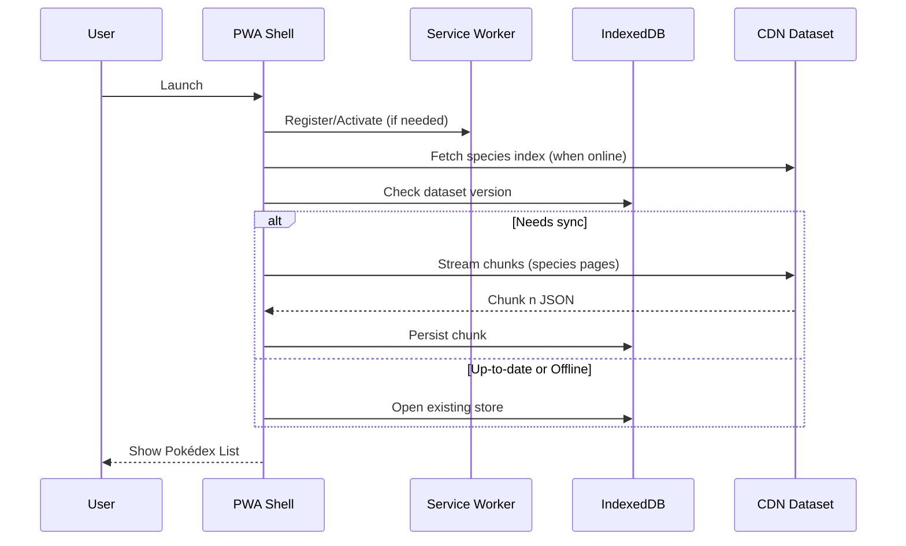
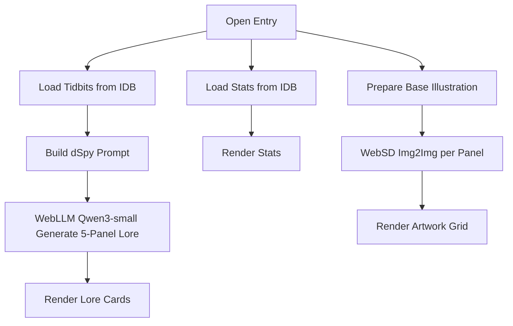
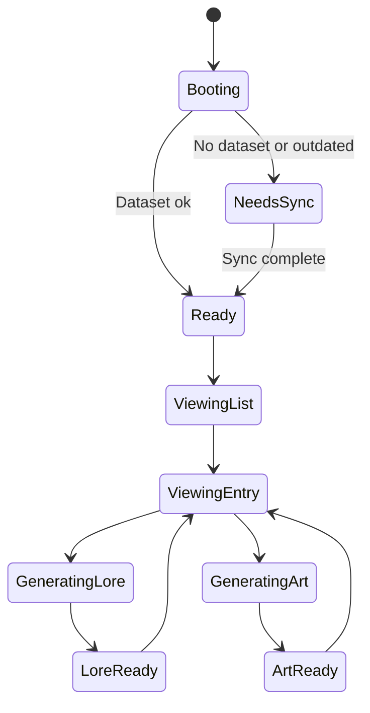

# Infinite Pokédex — App Flow Doc

This document narrates the end‑to‑end user journeys, UI states, and client data interactions for the Infinite Pokédex PWA. It complements the Project Requirements Doc and anchors UI implementation details. Language here is intentionally explicit and sequential.

## Launching the App (Cold Start)
User opens the app from the browser or PWA icon. A Rotom‑style splash appears immediately. While the splash is visible, the Service Worker (SW) is registered (if not yet), the Web App Manifest is loaded, and the app probes for connectivity.

If online, the app requests the species index JSON from the CDN. If IndexedDB (IDB) has no dataset or the CDN index version is newer, the app starts a resumable sync (paginated/species‑chunked). A progress ring shows percent completed. The user can tap “Browse while syncing,” which opens the Pokédex list with items populating as chunks complete. If offline, the app displays “Limited Mode” with a button “Use Cached Pokédex,” which opens the list backed entirely by existing IDB data.

After initial probes, the splash transitions to the home (Pokédex List) with a short whoosh animation. The SW continues caching critical assets in the background.

Mermaid Diagram:

Assumptions: Browser supports SW and IndexedDB on Android Chrome and Safari. Known Issues: Safari storage quotas differ; we implement adaptive chunk sizes and fallbacks.

## Pokédex List (Home)
The list displays species cards with sprite/illustration thumbnail, name, number, and types. A top search bar filters by name/number; a filter drawer toggles type, region, and availability (cached vs not yet cached). Pull‑to‑refresh triggers a dataset version check when online.

User taps a species card. The entry route pushes onto history; a subtle haptic feedback is triggered on supported devices.

Data interactions: the list queries IDB for species metadata and thumbnail paths. If a card’s assets are missing, the card shows a “Tap to fetch when online” badge; tapping while offline shows a toast explaining offline constraints.

## Pokémon Entry (Detail Screen)
The entry screen has three primary sections stacked vertically with a tabbed header: Stats, Lore, Artwork.

1. Stats Tab
When the entry loads, the app queries IDB for canonical metadata: height, weight, gender ratio, catch rate, moves, locations, abilities, and any flavor text. The UI renders immediately. If some fields are missing (partial dataset), placeholders with a dotted shimmer appear. A small source attribution footer is shown.

2. Lore Tab (On‑Device Generation)
When the user first visits or refreshes this entry, the client invokes WebLLM (selects the smallest Qwen3 model from the provided model list) and constructs a dSpy‑style prompt comprising: canonical entries and metadata (from IDB) + locally stored tidbits (iceberg items) + a generation template that yields a five‑part narrative (e.g., Ditto example). The generation runs on a worker thread to avoid UI jank. A progress pill shows “Composing lore…”. When finished, the five panels render as numbered cards with concise titles and 1‑3 sentences each. If generation fails (model memory or time limit), the app falls back to the last cached lore (if any) or a static compiled description.

3. Artwork Tab (Image‑to‑Image)
For each lore panel, the app constructs a prompt phrase and runs Web Stable Diffusion (WebSD) in image‑to‑image mode using the base 2D illustration as the init image. The app pre‑computes a low‑resolution preview quickly and upgrades to a higher‑quality render if the device remains idle or plugged in. If SD cannot run (resource constraints), the tab shows the base illustration with a banner “Lite artwork mode.”

Navigation: Swiping left/right moves between tabs; tapping the header toggles a condensed view. A share button exports the current screen as an image (stretch goal, disabled in MVP).

Mermaid Diagram:

Assumptions: Model artifacts are cached; workers available. Known Issues: Some iOS versions limit background JS time; we keep generation cancellable and resumable.

## PWA Install & Offline Behavior
From the list, the user taps “Install Pokédex.” On Android Chrome, the native install prompt appears; on Safari, instructions guide “Share → Add to Home Screen.” After install, the icon uses the Rotom‑style glyph.

On subsequent launches in airplane mode, the app opens directly to the list backed by IDB. Entering a species triggers lore generation again using cached tidbits/metadata. If the model cannot load offline due to missing weights, the app notifies the user and offers to switch to cached lore.

Background sync: When online, the SW checks for a new dataset version, fetches deltas, and updates IDB atomically. If a user is reading an entry that changes, we keep the current view stable and apply changes on next visit.

## Error Paths & Recovery
- Network: Exponential backoff; offline banner with retry; per‑species fetch retries are granular.
- Storage quota: Prompt to manage space; allow clearing derived artifacts (lore, SD results) while keeping canonical data.
- Model errors: Switch to lite mode; persist the error to avoid repeated failures within a session.
- Data integrity: Schema versioning; if a migration is required, we perform it lazily on first access and maintain a backup store until success.

## State Model (High‑Level)
Mermaid Diagram:

## Data Syncing Details
On save (sync), the client requests the species index manifest with version/hash. It compares to IDB’s stored version. If different, it fetches JSON in chunks (e.g., 100 species per chunk), validates hashes, and writes to a new object store keyed by version. After all chunks commit, it flips an alias pointer (e.g., `activeVersion`) for atomic cutover. Old versions are pruned based on quota policy.

Assumptions: CDN supports range or paginated endpoints; we have stable content hashes. Known Issues: Network partition during cutover is handled by keeping the previous version open until the new alias is set.

## Developer Notes
- UI components: Rotom‑style panels, cards, tab bars, and toasts live in `source/client/components/*` (see File Structure Doc)
- Workers: WebLLM and WebSD run in dedicated workers; messaging uses structured clone; progress is streamed back to UI
- Telemetry: None for PII; optional local debug console for developers behind a feature flag

