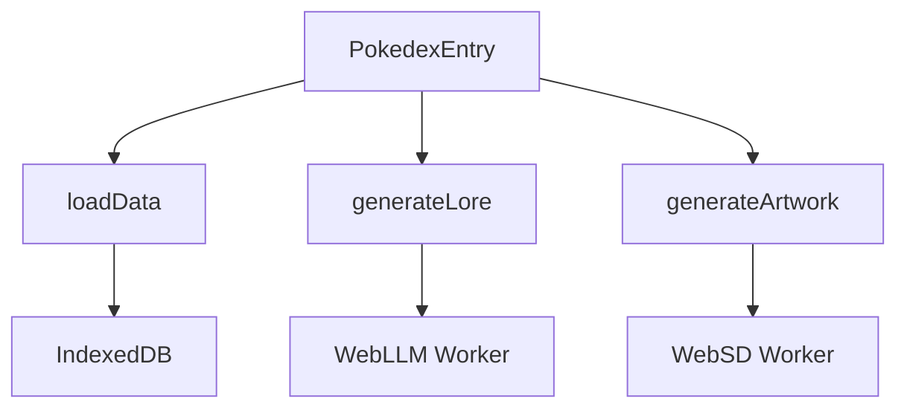

# Infinite Pokédex — Documentation Guidelines

This document details how to maintain and use documentation for Infinite Pokédex, ensuring cohesion as the project scales. Docs live in `/docs/`, updated alongside code changes. Agents must follow these rules: Reference context-boundary docs (e.g., Tech Stack) strictly; create/update docs for new code/tests; only edit with explicit user instruction. Use this as the single source for format/policy.

## Repo Documentation Structure

### Agent Reference Documents (`/docs/agents/`)
Core context boundaries that define project scope and implementation guidelines:
- **Project Requirements Doc.md** - High-level objectives, user flows, core features
- **App Flow Doc.md** - User interface flows, state transitions, data interactions
- **Tech Stack Doc.md** - Technologies, packages, dependencies, APIs
- **Frontend Guidelines.md** - Design system, coding standards, animation patterns
- **Backend Structure Doc.md** - Server architecture, data models, security policies
- **Implementation Plan.md** - Sprint-based roadmap with TCREI task structure
- **File Structure Doc.md** - File organization and modularity guidelines
- **Testing Guidelines.md** - Test types, setup, and quality gates
- **Documentation Guidelines.md** - This document (format and policy)

### Code Documentation (`/docs/code/`)
Per-module documentation with Mermaid diagrams and implementation details:
- **client/** - Frontend code documentation
  - `pokedex.md` - Core Pokédex logic and state management
  - `storage.md` - IndexedDB wrapper and data persistence
  - `workers.md` - Web Workers for AI processing
  - `animations.md` - Gen 9 Pokédex animations and transitions
- **server/** - Backend code documentation
  - `crawler.md` - Web scraping implementation and compliance
  - `parser.md` - HTML parsing and data normalization
  - `tidbit-synthesizer.md` - LLM integration and prompt engineering
  - `cdn-publisher.md` - Dataset building and CDN publishing

### Test Documentation (`/docs/tests/`)
Testing guides and documentation:
- **unit.md** - Unit testing guide with examples and coverage targets
- **integration.md** - End-to-end testing scenarios and browser automation
- **security.md** - Security testing and vulnerability scanning
- **performance.md** - Performance testing and optimization guidelines

## Format and Policy

### Docstrings for All Functions
Include comprehensive docstrings in all code files using JavaScript JSDoc format:

```javascript
/**
 * Generates lore for a Pokémon using WebLLM and tidbits.
 * Preconditions: WebLLM model loaded, species data available in IndexedDB
 * Postconditions: Returns array of 5 lore panels with title and body
 * @param {number} speciesId - The Pokémon species ID (e.g., 6 for Charizard)
 * @param {Object} options - Generation options
 * @param {string} options.model - WebLLM model to use (default: 'qwen3-small')
 * @param {boolean} options.regenerate - Force regeneration even if cached
 * @returns {Promise<Array<{title: string, body: string}>>} Array of lore panels
 * @throws {Error} If model fails to load or generation times out
 * @example
 * const lore = await generateLore(6, { model: 'qwen3-small' });
 * console.log(lore[0].title); // "The Mew Theory"
 */
async function generateLore(speciesId, options = {}) {
  // Implementation...
}
```

### Code Documentation Files
Each module in `/docs/code/` must include:

1. **Mermaid Diagram** - Visual representation of module structure and data flow
2. **Brief Description** - What the module does and its purpose
3. **Function Breakdown** - List of all functions/classes with docstring excerpts
4. **Usage Examples** - Code examples showing how to use the module
5. **Dependencies** - Other modules or external services required

#### Example: `/docs/code/client/pokedex.md`

```markdown
# Pokedex Core Logic

## Module Overview
The Pokedex module manages the core application state, species data, and user interactions. It coordinates between storage, AI generation, and UI components.

## Mermaid Diagram


## Functions

### PokedexEntry Class
**Location**: `/source/client/js/components/pokedex-entry.js`
**Purpose**: Manages individual Pokémon entry display and generation

#### Constructor
```javascript
constructor(speciesId, options = {})
```
- **Parameters**: `speciesId` (number), `options` (object)
- **Returns**: PokedexEntry instance
- **Preconditions**: Valid species ID exists in dataset
- **Postconditions**: Entry ready for data loading

#### loadData()
```javascript
async loadData()
```
- **Returns**: Promise<Object> - Species metadata and tidbits
- **Preconditions**: IndexedDB contains species data
- **Postconditions**: Entry populated with canonical data

#### generateLore()
```javascript
async generateLore(options = {})
```
- **Returns**: Promise<Array> - Array of 5 lore panels
- **Preconditions**: WebLLM model loaded, tidbits available
- **Postconditions**: Lore displayed in UI with animations
```

### Test Documentation

### Unit Tests (`/docs/tests/unit.md`)
Document unit testing approach, coverage targets, and test examples:

```markdown
# Unit Testing Guide

## Coverage Targets
- **Client Code**: 80%+ coverage for all JavaScript modules
- **Server Code**: 80%+ coverage for all Node.js modules
- **AI Integration**: 80%+ coverage for WebLLM/WebSD wrappers

## Test Examples

### PokedexEntry Tests
```javascript
describe('PokedexEntry', () => {
  test('should load species data from IndexedDB', async () => {
    const entry = new PokedexEntry(6);
    const data = await entry.loadData();
    expect(data.name).toBe('Charizard');
  });
});
```

## Running Tests
```bash
npm run test:unit
jest tests/unit --coverage
```
```

### Integration Tests (`/docs/tests/integration.md`)
Document end-to-end testing scenarios and browser automation:

```markdown
# Integration Testing Guide

## Test Scenarios

### PWA Installation Flow
1. User visits app URL
2. PWA install prompt appears
3. User installs PWA
4. App works offline after installation

### AI Generation Flow
1. User opens Pokémon entry
2. Lore generation starts automatically
3. Artwork generation begins
4. Both complete and display in UI

## Browser Testing
- **Chrome Android**: Primary target platform
- **Safari iOS**: Secondary target platform
- **Desktop**: Development and testing
```

## Sprint Documentation Policy

### End of Sprint Documentation Updates
At the end of each sprint, update documentation as follows:

**Sprint 1 (Foundation)**: Create basic code documentation structure
**Sprint 2 (Server Infrastructure)**: Add crawler and parser documentation
**Sprint 3 (Client Sync)**: Add storage and sync documentation
**Sprint 4 (WebLLM)**: Add AI generation documentation
**Sprint 5 (WebSD)**: Add image generation documentation
**Sprint 6 (UI Polish)**: Add animation and component documentation
**Sprint 7 (Testing)**: Add comprehensive test documentation
**Sprint 8 (Deployment)**: Add deployment and monitoring documentation

### Documentation Maintenance Rules

1. **New Code**: Create corresponding documentation in `/docs/code/`
2. **Code Changes**: Update existing documentation to match implementation
3. **Code Deletion**: Remove corresponding documentation
4. **Test Updates**: Update `/docs/tests/` when adding new tests
5. **Sprint Completion**: Review and update all relevant documentation

### Documentation Quality Standards

#### Mermaid Diagrams
- Use appropriate diagram types (flowchart, sequence, ER, state)
- Include clear labels and relationships
- Update diagrams when code structure changes
- Use consistent styling and colors

#### Code Examples
- Provide working, tested code examples
- Include error handling and edge cases
- Show both basic and advanced usage
- Update examples when APIs change

#### Function Documentation
- Include all required JSDoc tags
- Provide clear parameter and return descriptions
- Include usage examples in docstrings
- Document error conditions and exceptions

## Agent Responsibilities

### Before Starting Work
1. **Read Current Documentation**: Review relevant docs in `/docs/agents/`
2. **Check Existing Code Docs**: Look for existing documentation in `/docs/code/`
3. **Plan Documentation Updates**: Identify what docs need updating

### During Development
1. **Update Docstrings**: Add/update JSDoc comments for all functions
2. **Create Code Docs**: Add new documentation files for new modules
3. **Update Existing Docs**: Modify existing docs when changing code

### After Completing Work
1. **Verify Documentation**: Ensure all new code is documented
2. **Update Mermaid Diagrams**: Refresh diagrams if structure changed
3. **Test Documentation**: Verify examples and code snippets work
4. **Update Test Docs**: Add test documentation for new functionality

### Documentation Review Checklist
- [ ] All new functions have JSDoc docstrings
- [ ] All new modules have documentation files
- [ ] Mermaid diagrams are accurate and up-to-date
- [ ] Code examples are tested and working
- [ ] Test documentation covers new functionality
- [ ] Documentation follows established format and style

## Documentation Tools and Automation

### JSDoc Generation
```bash
# Generate API documentation from JSDoc comments
npm run docs:generate
```

### Mermaid Diagram Validation
```bash
# Validate Mermaid diagrams in documentation
npm run docs:validate-diagrams
```

### Documentation Linting
```bash
# Check documentation for broken links and formatting
npm run docs:lint
```

## Documentation Standards

### File Naming
- **Code Docs**: `kebab-case.md` (e.g., `pokedex-entry.md`)
- **Test Docs**: `kebab-case.md` (e.g., `unit-testing.md`)
- **Agent Docs**: `Title Case.md` (e.g., `Project Requirements Doc.md`)

### Markdown Formatting
- Use consistent heading hierarchy (H1 for main title, H2 for sections)
- Include table of contents for long documents
- Use code blocks with language specification
- Include links to related documentation

### Code Documentation Structure
```markdown
# Module Name

## Overview
Brief description of what the module does.

## Mermaid Diagram
[Visual representation of module structure]

## Functions
[Detailed function documentation]

## Usage Examples
[Code examples showing how to use the module]

## Dependencies
[Other modules or services required]
```

**Assumptions**: Modern development environment with JSDoc, Mermaid support, and documentation tools.  
**Known Issues**: Mermaid diagrams may not render in all markdown viewers; we provide alternative text descriptions.

Agents: Always update docs with code changes. Reference Implementation Plan for sprint alignment. Use this document as the single source for documentation format and policy.
