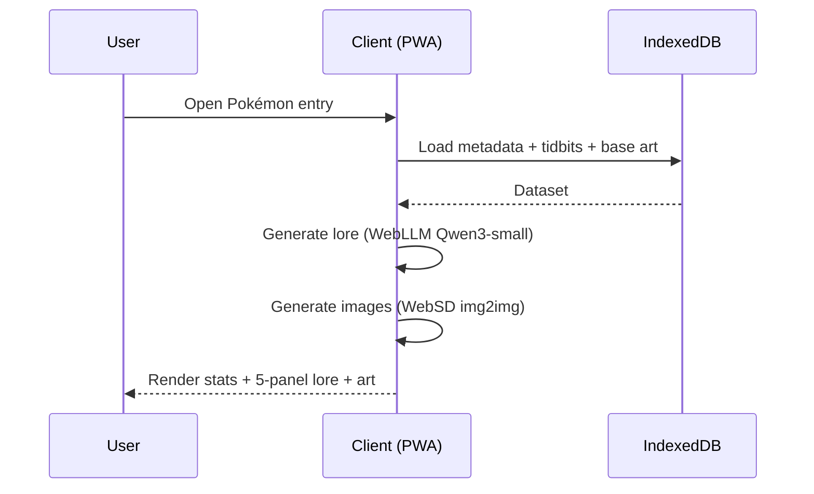
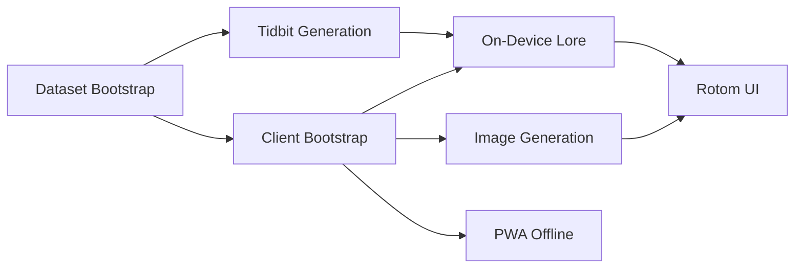

# Infinite Pokédex — Project Requirements Document (PRD)

This document defines the high‑level requirements, objectives, and scope for the Infinite Pokédex Progressive Web App (PWA). It serves as the single source of truth for features, constraints, success criteria, and cross‑agent alignment across sprints.

## Project Overview
Infinite Pokédex is a mobile‑first PWA that emulates the Generation 9 Pokédex (Rotom Phone) experience. It dynamically generates immersive, ever‑changing lore for each Pokémon by combining: (1) canonical Pokédex entries and game metadata (e.g., from Bulbapedia), (2) curated “iceberg” tidbits gathered via server‑side web crawling of reputable Pokémon sites/forums, and (3) on‑device LLM generation (WebLLM) guided by dSpy‑style prompting. Artwork is generated client‑side with Web Stable Diffusion (WebSD) using an image‑to‑image flow seeded by the Pokémon’s 2D illustration.

The app is designed to run fully offline after initial sync: server performs the one‑time crawl + tidbit distillation, publishes assets and metadata through a CDN; client fetches and persists via IndexedDB and regenerates the lore locally at each app boot so entries feel “infinite.”

- Platforms: Android Chrome PWA, Safari PWA (iOS/iPadOS/macOS Safari)
- Audience: Pokémon enthusiasts who enjoy deep lore, theories, and stylized entries
- Business goals: Delight via endlessly fresh content; showcase on‑device AI UX; enable shareable entries and future expansions

Non‑Functional Requirements
- Mobile‑first performance: TTI < 3s on mid‑range Android; smooth 60fps UI transitions
- Offline‑first: Fully functional entry browsing offline after initial sync; graceful degradation with missing assets
- Privacy: Generation occurs on‑device; no personal data collection
- Accessibility: WCAG AA contrast; dynamic font scaling; screen‑reader friendly navigation
- Reliability: Deterministic caching strategy; resumable sync; idempotent crawler

Assumptions
- Bulbapedia (and similar sites) allow fair‑use scraping of public pages within rate limits; we will obey robots.txt and use caching/backoff
- WebLLM provides a small Qwen3 model suitable for on‑device execution
- WebSD image‑to‑image can stylize 2D sprites into Gen‑9‑inspired artwork efficiently on mobile

Known Issues/Risks
- Mobile resource limits may constrain model sizes or SD steps; we must auto‑scale quality
- Copyright/fair‑use boundaries for artwork and scraped data must be respected; provide attribution and caching strategies
- Safari PWA feature gaps (e.g., Service Worker quirks) may impact installability or cache sizes

Mermaid Diagram
```mermaid
graph TD
  A[Public Pokémon Pages\n(Bulbapedia/Serebii/Forums)] -->|Crawler| B[Server: Crawl + Parse]
  B --> C[Tidbit Synthesis via OpenRouter LLM]
  B --> D[Canon Metadata (heights, moves, etc.)]
  D --> E[Build CDN Dataset]
  C --> E
  E --> F[Client First-Run Sync\n(IndexedDB + SW Cache)]
  F --> G[On-Device WebLLM (Qwen3-small)\nLore Generation]
  F --> H[WebSD Image2Image\nArtwork Generation]
  G --> I[Pokédex Entry View]
  H --> I
```

## User Flows
This section captures core journeys with success/abort paths. Detailed UI transitions live in the App Flow doc.

1) First Launch & Sync
1. User opens the app → sees a Rotom‑style splash and “Initialize Pokédex” CTA.
2. App checks connectivity:
   - Online: Fetches Pokémon index, per‑species metadata, tidbits, and base illustrations via CDN. Stores into IndexedDB and caches critical assets via Service Worker.
   - Offline: Shows “Limited Mode” with whatever is cached; prompts to connect for full database.
3. Progress indicator shows sync status; user can browse entries as they become available.
4. Success: IndexedDB populated, manifest installed; app is PWA‑installable.
5. Errors: Network timeouts → exponential backoff + resumable chunked sync; storage quota → prompt to manage space.

2) Browse Pokémon Entry
1. User scrolls/searches/filter by type/region → selects a Pokémon.
2. Client loads metadata + tidbits from IndexedDB.
3. WebLLM (Qwen3‑small) synthesizes lore into a 5‑panel “iceberg” style narrative (e.g., Ditto example), using dSpy‑guided prompt templates.
4. WebSD performs image‑to‑image on the Pokémon illustration with a per‑panel prompt to produce 2D Gen‑9‑styled artwork.
5. Entry screen displays: basic stats (height, weight, catch rate, locations, moves), regenerated lore panels, and artwork per panel.
6. Success: Smooth rendering, responsive gestures, offline capable.
7. Errors: If WebLLM/WebSD fail due to resources, fallback to last‑generated content or static illustration.

3) PWA Install & Offline Use
1. User taps “Install to Home Screen.”
2. App installs manifest/service worker; assets are cached.
3. On next launch (airplane mode), entries remain browsable; lore regenerates locally using cached tidbits/metadata.
4. Success: Zero‑network browsing; background sync opportunistic when online.

Assumptions
- First run may be longer due to asset pull; we stream and interleave UX to keep it usable

Known Issues
- IndexedDB quota differences across Safari/Android; we implement adaptive cache policies and LRU eviction of derived artifacts

Mermaid Sequence (Browse Entry)


## Tech Stack & APIs
Frontend (Client)
- React (or lightweight framework TBD in Tech Stack Doc) for UI; TypeScript where applicable
- PWA: Web App Manifest, Service Worker, Cache Storage
- Storage: IndexedDB (idb wrapper), deterministic keys per species/version
- AI: WebLLM (Qwen3‑small via model list), dSpy‑style prompt construction, Web Stable Diffusion (image‑to‑image)
- Styling: Gen‑9 Rotom UI components, CSS modules or Tailwind (see Frontend Guidelines)

Backend (Server)
- Node.js service providing:
  - Crawler: respectful scraping of Bulbapedia, Serebii, Marilland, and select forums
  - Parser & normalizer: canonical metadata schema (height, weight, gender ratio, catch rate, moves, locations, etc.)
  - Tidbit synthesis: OpenRouter LLM to condense forum/theory data into “iceberg” items (safety filtered)
  - Build + publish: produce CDN dataset (static JSON + media) consumed by clients
- Persistence: Build artifacts hosted on CDN; server maintains crawl cache

External Services & Docs
- Bulbapedia: `https://bulbapedia.bulbagarden.net/wiki/Charizard_(Pokémon)#Pokédex_entries`
- Serebii, Marilland, official/community forums (respect robots.txt)
- OpenRouter LLM API (server‑side tidbit distillation)
- WebLLM (client‑side) model list; select smallest Qwen3 model at runtime
- Web Stable Diffusion (browser) for image‑to‑image

Constraints
- Node.js v18+; modern browsers (Chrome Android, Safari iOS/macOS) with Service Workers & IndexedDB
- No user PII; comply with content and IP policies; cache TTLs + attribution where required

## Core Features (MVP → v1)
1. Pokémon Dataset Bootstrap
   - Crawl canonical entries + metadata; normalize into our schema; export per‑species JSON
2. Tidbit Generation Pipeline (Server)
   - Crawl reputable sources; filter, rank, and distill via OpenRouter LLM to 3‑7 iceberg items/species
3. Client Bootstrap & Offline Caching
   - First‑run sync to IndexedDB; resumable; SW caching for critical assets
4. On‑Device Lore Generation
   - WebLLM (Qwen3‑small) composes a 5‑panel lore narrative per entry using dSpy‑style prompts and local metadata/tidbits
5. Image Generation (WebSD)
   - Image‑to‑image using Bulbapedia 2D illustration + per‑panel prompt; 2D Gen‑9‑inspired aesthetic
6. Rotom‑Style UI
   - Gen‑9 themed layout; search/filter; per‑entry view with stats + lore panels + artwork
7. PWA Installability & Offline Use
   - Manifest, icons, SW strategies, background sync, quota management
8. Safety & Compliance
   - Respect robots.txt, rate limits; content filters for generated text; attribution for sources

Stretch (Post‑v1)
- Share/export an entry as an image bundle
- Multi‑language support; model‑size selection based on device capability
- Optional server sync for newly discovered tidbits (versioned datasets)

Mermaid Feature Dependencies


## In‑Scope vs Out‑of‑Scope
- In‑Scope (MVP/v1)
  - Respectful crawling and server‑side tidbit distillation
  - Client IndexedDB caching, PWA installability
  - WebLLM (Qwen3‑small) on‑device lore generation each app start
  - WebSD image‑to‑image artwork generation
  - Gen‑9 Rotom UI with searchable index and detailed entry view

- Out‑of‑Scope (for now)
  - User accounts, cloud profiles, or server‑side personalization
  - Real‑time multiplayer or social feeds
  - Heavy 3D rendering; non‑browser native apps
  - Continuous background crawling beyond controlled server runs

Assumptions
- Focus remains on delightful single‑user PWA experience with deterministic public datasets

Known Issues
- Some devices may be too constrained for SD; we’ll provide a “lite” path using static art + cached last lore

## Acceptance Criteria & Metrics
- First‑run sync completes under 2 minutes on a fast connection for base dataset (exact target set in Implementation Plan)
- Cold start < 3s to interactive; entry generation end‑to‑end < 6s on target device class (tunable)
- 100% offline functionality for previously synced species (viewing + regeneration with cached tidbits)
- Accessibility checks pass (WCAG AA color contrast, proper ARIA labels)
- Security: No high/critical findings in security scans; crawler respects robots.txt and rate limits

## References
- Inspiration: TikTok account “starstatik” iceberg‑style Pokémon lore slideshows
- Canon example: Charizard entries on Bulbapedia (see link above)
- Internal docs: App Flow Doc, Tech Stack Doc, Backend Structure Doc, Implementation Plan, Testing Guidelines


