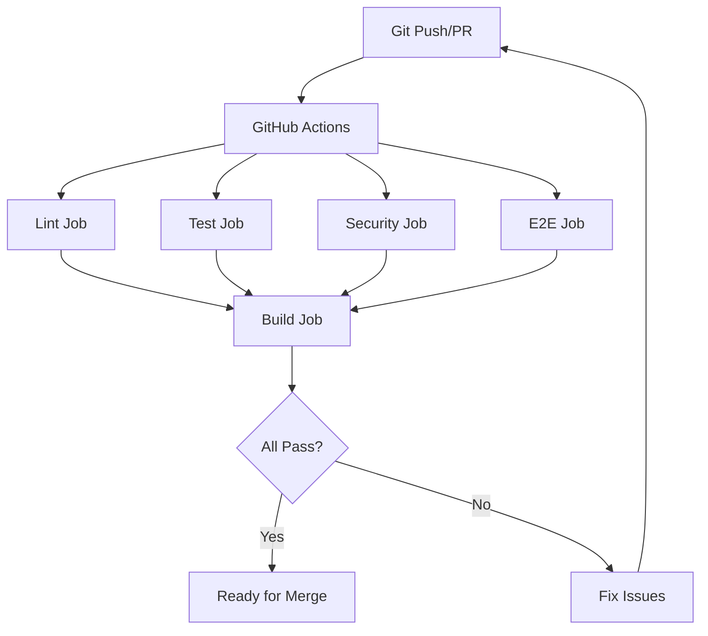

# DevOps & CI/CD Documentation

This document describes the development environment, testing infrastructure, and CI/CD pipeline for Infinite Pokédex.

## Overview

The DevOps setup includes:
- GitHub Actions CI/CD pipeline
- Docker containerization for crawler
- ESLint security scanning
- Playwright E2E testing
- Automated quality gates

## CI/CD Pipeline

### GitHub Actions Workflow

Located in `.github/workflows/ci.yml`, the pipeline runs on:
- Push to `main` or `develop` branches
- Pull requests to `main` or `develop`

### Pipeline Jobs

#### 1. Lint Job
**Purpose**: Code quality and style checking
**Steps**:
- Setup Node.js 18
- Install dependencies
- Run ESLint
- Run Prettier format check

#### 2. Test Job
**Purpose**: Unit testing with coverage
**Steps**:
- Setup Node.js 18
- Install dependencies
- Run Jest with coverage
- Upload coverage to Codecov

#### 3. Security Job
**Purpose**: Vulnerability scanning
**Steps**:
- Setup Node.js 18
- Install dependencies
- Run npm audit
- Run security linting with ESLint-plugin-security

#### 4. E2E Job
**Purpose**: End-to-end testing
**Steps**:
- Setup Node.js 18
- Install dependencies
- Install Playwright browsers (Chromium)
- Run Playwright tests
- Upload test results as artifacts

#### 5. Build Job
**Purpose**: Production build verification
**Steps**:
- Setup Node.js 18
- Install dependencies
- Build client with Vite
- Upload build artifacts

## Docker Configuration

### Dockerfile

**Base Image**: `node:18-slim`
**Purpose**: Containerized crawler environment with Puppeteer

**Key Features**:
- Installs Chromium for Puppeteer
- Sets up production dependencies
- Creates data directories for cache and output
- Exposes port 3000 for health checks

**Build Command**:
```bash
docker build -t infinite-pokedex-crawler .
```

### Docker Compose

**Services**:
- `crawler`: Production crawler service
- `dev`: Development environment

**Volumes**:
- `./data/cache`: HTML cache persistence
- `./data/output`: Generated dataset output

**Commands**:
```bash
# Build containers
npm run docker:build

# Start services
npm run docker:up

# Stop services
npm run docker:down

# View logs
npm run docker:logs
```

## ESLint Security Configuration

### Security Rules

Located in `.eslintrc.js`, includes:
- `security/detect-object-injection`: Warn on dynamic object access
- `security/detect-unsafe-regex`: Error on ReDoS vulnerabilities
- `security/detect-eval-with-expression`: Error on eval usage
- `security/detect-child-process`: Warn on child process usage
- `security/detect-non-literal-fs-filename`: Warn on dynamic file paths

### Running Security Scans

```bash
# Run security linting
npm run lint:security

# Fix auto-fixable issues
npm run lint:fix

# Run npm audit
npm audit
```

## Development Scripts

### Setup Script (`scripts/setup.sh`)

**Purpose**: Initialize development environment
**Actions**:
- Checks Node.js version (18+ required)
- Installs npm dependencies
- Installs Playwright browsers
- Creates data directories
- Creates `.env` from template
- Runs initial tests

**Usage**:
```bash
./scripts/setup.sh
```

### Dev Server Script (`scripts/run-dev.sh`)

**Purpose**: Start development server
**Actions**:
- Checks for dependencies
- Runs setup if needed
- Starts Vite dev server

**Usage**:
```bash
./scripts/run-dev.sh
```

### Test Suite Script (`scripts/test-suite.sh`)

**Purpose**: Run all tests
**Actions**:
- Runs ESLint
- Runs Prettier
- Runs Jest unit tests
- Runs cache key fix tests
- Runs Playwright E2E tests
- Displays PWA test checklist

**Usage**:
```bash
./scripts/test-suite.sh
```

## Quality Gates

### Pre-Commit Checks
- ESLint must pass
- Prettier formatting must be correct
- No security vulnerabilities (high/critical)

### Pre-Merge Checks
- All unit tests pass (80%+ coverage)
- All E2E tests pass
- Security scans clean
- Build succeeds

### Production Deployment
- All CI/CD jobs pass
- Manual approval required
- Rollback capability available

## Playwright Configuration

**Config File**: `playwright.config.js`

**Settings**:
- Test directory: `./tests/integration`
- Base URL: `http://localhost:5173`
- Retries: 2 in CI, 0 locally
- Workers: 1 in CI, auto locally
- Reporter: HTML

**Devices**:
- Desktop Chrome
- Mobile Chrome (Pixel 5)
- Mobile Safari (iPhone 12)

**Web Server**:
- Command: `npm run dev`
- URL: `http://localhost:5173`
- Timeout: 120 seconds

## Mermaid Diagram



## Environment Variables

**Required**:
- `OPENROUTER_API_KEY`: OpenRouter API key for tidbit synthesis
- `CDN_BUCKET_URL`: CDN URL for dataset hosting

**Optional**:
- `CRAWL_RATE_LIMIT`: Requests per minute (default: 1000)
- `NODE_ENV`: Environment (development/production)
- `LOG_LEVEL`: Logging level (debug/info/warn/error)

## Monitoring & Observability

### Health Checks
- Docker containers expose `/health` endpoint
- GitHub Actions monitors job status
- Playwright generates HTML reports

### Logs
- Structured logging with logger utility
- Docker logs accessible via `docker-compose logs`
- CI/CD logs in GitHub Actions interface

### Metrics
- Test coverage tracked in Codecov
- Build times monitored in GitHub Actions
- E2E test results in Playwright reports

## Troubleshooting

### CI/CD Failures
- Check GitHub Actions logs
- Verify environment variables
- Test locally with same Node version

### Docker Issues
- Ensure Docker daemon is running
- Check port conflicts (3000, 5173)
- Verify volume permissions

### E2E Test Failures
- Check Playwright report in artifacts
- Run locally with `--headed` flag
- Verify dev server is accessible

## Best Practices

- Always run tests before committing
- Use Docker for consistent environments
- Keep dependencies up to date
- Monitor security vulnerabilities
- Review CI/CD logs regularly
- Update documentation with changes
