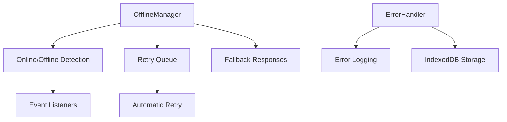

# Offline Support Documentation

## Overview

The Offline Support system handles offline detection, fallback content, error recovery, and retry mechanisms. It ensures the app remains functional when network connectivity is lost.

## Architecture



## Core Components

### OfflineManager Class

Manages offline state and provides fallback mechanisms.

**Location**: `source/client/js/offline.js`

**Dependencies**:
- `logger.js` - Logging utilities
- `storage.js` - IndexedDB wrapper

**Key Methods**:

#### `getOnlineStatus()`
Returns the current online/offline status.

**Returns**: boolean - True if online

#### `addListener(callback)`
Registers a listener for online/offline changes.

**Parameters**:
- `callback` (Function) - Callback function (isOnline) => void

#### `addToRetryQueue(request, options)`
Adds a failed request to the retry queue.

**Parameters**:
- `request` (Request|Function) - Request to retry
- `options` (Object) - Retry options (maxAttempts, etc.)

#### `processRetryQueue()`
Processes all queued requests when connection is restored.

**Preconditions**: Connection is online
**Postconditions**: All queued requests are retried

#### `handleFetch(request)`
Handles fetch with offline fallback.

**Parameters**:
- `request` (Request) - The request to handle

**Returns**: Promise<Response> - Response from network or cache

#### `getOfflineFallback(request)`
Gets appropriate fallback response for offline requests.

**Parameters**:
- `request` (Request) - The failed request

**Returns**: Promise<Response> - Fallback response

### ErrorHandler Class

Centralized error management and logging.

**Location**: `source/client/js/offline.js`

**Dependencies**:
- `logger.js` - Logging utilities
- `storage.js` - IndexedDB wrapper

**Key Methods**:

#### `handleError(error, context)`
Handles an error by logging and storing it.

**Parameters**:
- `error` (Error|string) - The error to handle
- `context` (Object) - Additional context

#### `getErrorLog()`
Returns the current error log.

**Returns**: Array - Array of error entries

#### `clearErrorLog()`
Clears the in-memory error log.

#### `getStoredErrors()`
Retrieves errors from IndexedDB.

**Returns**: Promise<Array> - Stored errors

#### `clearStoredErrors()`
Clears stored errors from IndexedDB.

## Online/Offline Detection

### Browser Events

The system listens to browser online/offline events:

```javascript
window.addEventListener('online', () => handleOnline());
window.addEventListener('offline', () => handleOffline());
```

### Status Monitoring

```javascript
// Check current status
const isOnline = offlineManager.getOnlineStatus();

// Listen for changes
offlineManager.addListener((isOnline) => {
  if (isOnline) {
    console.log('Connection restored');
  } else {
    console.log('Connection lost');
  }
});
```

## Retry Queue

### Adding Requests

Failed requests are automatically added to the retry queue:

```javascript
try {
  await fetch('/api/data');
} catch (error) {
  offlineManager.addToRetryQueue(
    () => fetch('/api/data'),
    { maxAttempts: 3 }
  );
}
```

### Automatic Retry

When connection is restored, the retry queue is automatically processed:

1. **Online Event**: Browser fires online event
2. **Queue Processing**: Process all queued requests
3. **Retry Logic**: Retry each request with exponential backoff
4. **Failure Handling**: Re-queue if max attempts not reached

### Queue Management

```javascript
// Get queue size
const size = offlineManager.getRetryQueueSize();

// Clear queue
offlineManager.clearRetryQueue();
```

## Fallback Responses

### Navigation Requests

For page navigation, return offline HTML page:

```javascript
if (request.mode === 'navigate') {
  return caches.match('/offline.html');
}
```

### API Requests

For API requests, return error JSON:

```javascript
{
  error: 'Offline',
  message: 'This content is not available offline',
  cached: false
}
```

### Image Requests

For images, return SVG placeholder:

```svg
<svg width="400" height="400">
  <rect fill="#f0f0f0"/>
  <text>Image not available offline</text>
</svg>
```

## Offline Page

### Design

The offline page provides:
- Clear offline status message
- Connection check button
- Automatic retry when online
- Visual feedback

**Location**: `source/client/offline.html`

### Features

1. **Manual Check**: User can manually check connection
2. **Automatic Detection**: Listens for online events
3. **Periodic Checks**: Checks connection every 5 seconds
4. **Auto-Redirect**: Redirects to home when online

## Error Handling

### Global Error Handlers

The system captures all uncaught errors:

```javascript
window.addEventListener('error', (event) => {
  errorHandler.handleError(event.error);
});

window.addEventListener('unhandledrejection', (event) => {
  errorHandler.handleError(event.reason);
});
```

### Error Storage

Errors are stored in IndexedDB for debugging:

```javascript
{
  message: 'Network request failed',
  stack: '...',
  context: {
    type: 'uncaught',
    filename: 'sync.js',
    lineno: 42
  },
  timestamp: 1234567890
}
```

### Error Limits

- **Memory**: 100 errors maximum
- **Storage**: 100 errors maximum
- **Rotation**: Oldest errors removed when limit reached

## Integration

### With Service Worker

The Service Worker uses offline manager for:
- Cache fallbacks
- Offline page serving
- Request retry coordination

### With CDN Sync

The sync system uses offline manager for:
- Network failure detection
- Automatic retry when online
- Progress updates during offline periods

### With UI

The UI uses offline manager for:
- Status indicators
- Offline messaging
- Retry notifications

## Testing

### Unit Tests

**Location**: `tests/unit/offline.test.js`

**Coverage**:
- Online/offline detection
- Listener management
- Retry queue
- Fallback responses
- Error handling
- Error storage

### Manual Testing

1. **Go Offline**: Disable network in DevTools
2. **Navigate**: Try to navigate to different pages
3. **Verify Fallback**: Check offline page is shown
4. **Go Online**: Re-enable network
5. **Verify Retry**: Check requests are retried

## Performance

### Memory Usage

- Retry queue: ~1KB per request
- Error log: ~100 bytes per error
- Total overhead: <100KB typical

### Storage Usage

- Error log: ~10KB maximum
- Minimal impact on IndexedDB quota

## Security

### Error Information

- Sensitive data filtered from error logs
- Stack traces sanitized
- Context limited to debugging info

### Retry Security

- Maximum retry attempts enforced
- Exponential backoff prevents flooding
- Queue size limits prevent memory issues

## Best Practices

### Offline-First Design

1. **Cache Critical Assets**: Cache all static assets
2. **Graceful Degradation**: Provide fallbacks for all features
3. **Clear Messaging**: Inform users of offline status
4. **Auto-Recovery**: Automatically retry when online

### Error Handling

1. **Catch All Errors**: Use global error handlers
2. **Log Context**: Include relevant context
3. **User Feedback**: Show user-friendly messages
4. **Debug Info**: Store detailed info for debugging

## Future Enhancements

1. **Smart Retry**: Prioritize important requests
2. **Offline Analytics**: Track offline usage patterns
3. **Predictive Caching**: Pre-cache likely needed content
4. **Background Sync**: Use Background Sync API
5. **Network Quality**: Detect slow connections

## Troubleshooting

### Retry Queue Not Processing

- Check online status
- Verify event listeners are registered
- Check browser console for errors

### Offline Page Not Showing

- Verify offline.html is cached
- Check Service Worker is active
- Verify fetch handler is working

### Errors Not Logging

- Check IndexedDB quota
- Verify error handlers are registered
- Check logger configuration

## Related Documentation

- [Service Worker](./sw.md)
- [CDN Sync System](./sync.md)
- [IndexedDB Storage](./storage.md)
- [UI Components](./sync-ui.md)
