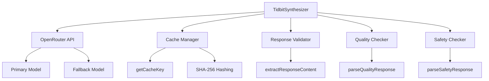

# Tidbit Synthesizer Documentation

## Overview

The `TidbitSynthesizer` class integrates with OpenRouter LLM to generate "iceberg" style tidbits from crawled Pokémon data and forum discussions. It includes comprehensive error handling, caching, safety validation, and quality control mechanisms.

**File**: `source/server/processors/tidbit-synthesizer.js`  
**Dependencies**: axios, crypto, logger, models config  
**Version**: 1.0.0

## Architecture



## Class Structure

### Constructor

```javascript
constructor(config);
```

**Description**: Initializes the TidbitSynthesizer with OpenRouter API configuration.

**Pre**:

- config object must contain valid openRouterApiKey

**Post**:

- Axios client configured with API credentials
- Cache Map initialized
- API key validated

**Parameters**:

- `config` (Object): Configuration object
  - `config.openRouterApiKey` (String): OpenRouter API key (required)

**Throws**: Error if API key is missing

**Example**:

```javascript
const synthesizer = new TidbitSynthesizer({
  openRouterApiKey: 'sk-or-...',
});
```

## Core Methods

### enrich()

```javascript
async enrich(processedData)
```

**Description**: Enriches all species data with generated tidbits, includes rate limiting between requests.

**Pre**:

- processedData is a valid object with species IDs as keys
- Each species has required data fields (name, types, stats, etc.)

**Post**:

- Returns enriched data with tidbits for each species
- Failed species enrichment falls back to original data
- 1-second delay between species to respect rate limits

**Parameters**:

- `processedData` (Object): Object containing species data keyed by species ID

**Returns**:

- Promise<Object>: Enriched data with tidbits added to each species

**Example**:

```javascript
const enrichedData = await synthesizer.enrich({
  pikachu: {
    name: 'Pikachu',
    types: ['Electric'],
    stats: { hp: 35, attack: 55 },
  },
});
```

### enrichSpecies()

```javascript
async enrichSpecies(speciesId, speciesData)
```

**Description**: Enriches a single species with AI-generated tidbits. Handles forum data fetching, cache management, tidbit generation, and validation.

**Pre**:

- speciesId is a valid string identifier
- speciesData contains required species information

**Post**:

- Returns species data with validated tidbits
- Result is cached for future requests
- Falls back to original data on error

**Parameters**:

- `speciesId` (String): Unique identifier for the species
- `speciesData` (Object): Species data object

**Returns**:

- Promise<Object>: Species data with tidbits array added

**Example**:

```javascript
const enriched = await synthesizer.enrichSpecies('pikachu', {
  name: 'Pikachu',
  types: ['Electric'],
  description: 'An electric mouse Pokémon',
});
```

### extractResponseContent() **[NEW]**

```javascript
extractResponseContent(response, (context = 'API call'));
```

**Description**: Safely extracts message content from OpenRouter API response with comprehensive validation at each level. Prevents runtime errors from malformed or unexpected API responses.

**Pre**:

- response is an axios response object from OpenRouter API call

**Post**:

- Returns extracted content string if response is valid
- Throws descriptive error if any validation fails

**Parameters**:

- `response` (Object): Axios response object from API call
- `context` (String): Context string for error messages (default: 'API call')

**Returns**:

- String: Extracted message content from API response

**Throws**:

- Error: If response structure is invalid at any level
  - Missing response.data
  - Missing or invalid choices array
  - Empty choices array
  - Missing message object
  - Missing or invalid content string

**Example**:

```javascript
try {
  const content = synthesizer.extractResponseContent(
    response,
    'tidbit generation'
  );
  const parsed = this.parseTidbitsResponse(content);
} catch (error) {
  logger.error('Failed to extract response:', error.message);
  // Error message includes context for debugging
}
```

**Validation Flow**:

1. ✅ Check response exists and has data property
2. ✅ Verify choices is an array
3. ✅ Ensure choices array is not empty
4. ✅ Confirm first choice has message object
5. ✅ Validate content is a string
6. ✅ Return extracted content

### generateTidbits()

```javascript
async generateTidbits(speciesData, forumData)
```

**Description**: Generates tidbits using primary LLM model with automatic fallback to secondary model on failure.

**Pre**:

- speciesData is formatted species information string
- forumData is forum discussion text (can be empty)

**Post**:

- Returns array of generated tidbits
- Falls back to fallback model on primary model failure
- Returns empty array if both models fail

**Parameters**:

- `speciesData` (String): Formatted species data
- `forumData` (String): Forum discussion data

**Returns**:

- Promise<Array>: Array of tidbit objects with title, body, sourceRefs

**Example**:

```javascript
const tidbits = await synthesizer.generateTidbits(
  'Name: Pikachu\nTypes: Electric\n...',
  'Forum discussions about Pikachu...'
);
```

### generateTidbitsFallback()

```javascript
async generateTidbitsFallback(speciesData, forumData)
```

**Description**: Generates tidbits using fallback LLM model with simplified configuration.

**Pre**:

- Primary model has failed
- speciesData and forumData are valid strings

**Post**:

- Returns array of tidbits from fallback model
- Uses extractResponseContent() for safe response parsing

**Parameters**:

- `speciesData` (String): Formatted species data
- `forumData` (String): Forum discussion data

**Returns**:

- Promise<Array>: Array of tidbit objects

### validateTidbits()

```javascript
async validateTidbits(tidbits)
```

**Description**: Validates and filters tidbits through safety and quality checks, limiting to 7 best tidbits.

**Pre**:

- tidbits is an array of tidbit objects
- Each tidbit has title and body properties

**Post**:

- Returns validated tidbits (max 7)
- Unsafe or low-quality tidbits removed
- Each tidbit enhanced with quality metrics

**Parameters**:

- `tidbits` (Array): Raw tidbits from LLM

**Returns**:

- Promise<Array>: Validated and quality-checked tidbits (max 7)

**Validation Steps**:

1. Basic validation (title and body present)
2. Safety check (content appropriateness)
3. Quality check (accuracy, interest, clarity)
4. Limit to top 7 tidbits

### checkSafety()

```javascript
async checkSafety(tidbit)
```

**Description**: Checks tidbit content for safety and appropriateness using LLM validation model.

**Pre**:

- tidbit has title and body properties

**Post**:

- Returns safety assessment with confidence score
- Falls back to safe default on validation failure

**Parameters**:

- `tidbit` (Object): Tidbit to check
  - `tidbit.title` (String): Tidbit title
  - `tidbit.body` (String): Tidbit body text

**Returns**:

- Promise<Object>: Safety check result
  - `safe` (Boolean): Whether content is safe
  - `issues` (Array): List of identified issues
  - `confidence` (Number): Confidence score (0-1)

**Example**:

```javascript
const safetyCheck = await synthesizer.checkSafety({
  title: 'Pikachu Origins',
  body: 'Based on a pika...',
});

if (safetyCheck.safe) {
  // Proceed with tidbit
}
```

### checkQuality()

```javascript
async checkQuality(tidbit)
```

**Description**: Evaluates tidbit quality across multiple dimensions using LLM validation model.

**Pre**:

- tidbit has title and body properties

**Post**:

- Returns quality metrics and approval status
- Falls back to default approval on validation failure

**Parameters**:

- `tidbit` (Object): Tidbit to evaluate
  - `tidbit.title` (String): Tidbit title
  - `tidbit.body` (String): Tidbit body text

**Returns**:

- Promise<Object>: Quality assessment
  - `approved` (Boolean): Whether tidbit meets quality standards
  - `accuracy` (Number): Accuracy score (1-5)
  - `appropriateness` (Number): Appropriateness score (1-5)
  - `interest` (Number): Interest level score (1-5)
  - `clarity` (Number): Clarity score (1-5)

**Example**:

```javascript
const qualityCheck = await synthesizer.checkQuality({
  title: 'Pikachu Origins',
  body: 'Based on a pika...',
});

if (qualityCheck.approved && qualityCheck.interest >= 4) {
  // High-quality, interesting tidbit
}
```

## Utility Methods

### getCacheKey()

```javascript
getCacheKey(speciesId, speciesData, forumData);
```

**Description**: Generates stable cache key using SHA-256 hash of essential species data and forum data.

**Pre**:

- speciesId is a valid string
- speciesData contains species information
- forumData is a string (can be empty)

**Post**:

- Returns unique cache key for the species/forum combination
- Key remains stable for same inputs

**Parameters**:

- `speciesId` (String): Species identifier
- `speciesData` (Object): Species data (only stable fields used)
- `forumData` (String): Forum discussion data

**Returns**:

- String: Cache key in format `{speciesId}-{sha256Hash}`

**Cache Key Composition**:

- Uses only stable fields: name, types, stats, abilities, description, trivia
- Excludes dynamic fields like tidbits array
- Includes normalized forum data
- Uses full SHA-256 hash (64 chars) to minimize collision risk

### formatSpeciesData()

```javascript
formatSpeciesData(speciesData);
```

**Description**: Formats species data into readable text for LLM prompt.

**Parameters**:

- `speciesData` (Object): Species data object

**Returns**:

- String: Formatted species data

**Example Output**:

```
Name: Pikachu
Types: Electric
Stats: hp: 35, attack: 55, defense: 40
Abilities: Static, Lightning Rod
Description: An electric mouse Pokémon
```

### getForumData()

```javascript
async getForumData(speciesId)
```

**Description**: Retrieves forum discussion data for species (placeholder for future implementation).

**Parameters**:

- `speciesId` (String): Species identifier

**Returns**:

- Promise<String>: Forum discussion data

**Note**: Currently returns placeholder. TODO: Implement actual forum scraping integration.

### parseTidbitsResponse()

```javascript
parseTidbitsResponse(content);
```

**Description**: Parses LLM response content to extract tidbits, handles both JSON and text formats.

**Parameters**:

- `content` (String): LLM response content

**Returns**:

- Object: Parsed response with tidbits array

### parseSafetyResponse()

```javascript
parseSafetyResponse(content);
```

**Description**: Parses safety check response from LLM.

**Parameters**:

- `content` (String): LLM response content

**Returns**:

- Object: Safety check result

### parseQualityResponse()

```javascript
parseQualityResponse(content);
```

**Description**: Parses quality check response from LLM.

**Parameters**:

- `content` (String): LLM response content

**Returns**:

- Object: Quality assessment result

### getStats()

```javascript
getStats();
```

**Description**: Returns current synthesizer statistics.

**Returns**:

- Object: Statistics
  - `cacheSize` (Number): Number of cached entries
  - `apiKey` (String): API key status ('configured' or 'missing')
  - `baseUrl` (String): OpenRouter API base URL

### clearCache()

```javascript
clearCache();
```

**Description**: Clears the tidbit cache.

**Post**: Cache is empty

## Error Handling

### Response Validation Errors

All LLM API calls use `extractResponseContent()` which throws descriptive errors:

```javascript
try {
  const content = this.extractResponseContent(response, 'tidbit generation');
} catch (error) {
  // Error includes context in message:
  // "Invalid response structure in tidbit generation: choices array is empty"
  logger.error('API call failed:', error.message);
  // Fall back to alternative behavior
}
```

### Graceful Degradation

The synthesizer implements multiple fallback layers:

1. **Primary Model Failure** → Try fallback model
2. **Fallback Model Failure** → Return empty tidbits array
3. **Safety Check Failure** → Default to safe with low confidence
4. **Quality Check Failure** → Default to approved with average scores
5. **Species Enrichment Failure** → Return original species data

## Usage Examples

### Basic Usage

```javascript
import { TidbitSynthesizer } from './processors/tidbit-synthesizer.js';

const synthesizer = new TidbitSynthesizer({
  openRouterApiKey: process.env.OPENROUTER_API_KEY,
});

// Enrich single species
const enriched = await synthesizer.enrichSpecies('pikachu', speciesData);
console.log(enriched.tidbits); // Array of 0-7 validated tidbits

// Enrich multiple species
const allEnriched = await synthesizer.enrich(processedData);
```

### Error Handling Example

```javascript
try {
  const enriched = await synthesizer.enrichSpecies('pikachu', speciesData);

  if (enriched.tidbits.length === 0) {
    console.warn('No tidbits generated for Pikachu');
  }
} catch (error) {
  console.error('Enrichment failed:', error.message);
  // Use original data without tidbits
}
```

### Cache Management

```javascript
// Check cache status
const stats = synthesizer.getStats();
console.log(`Cache size: ${stats.cacheSize}`);

// Clear cache if needed
if (stats.cacheSize > 1000) {
  synthesizer.clearCache();
}
```

## Testing

**Test File**: `tests/unit/tidbit-synthesizer.test.js`  
**Test Count**: 25 tests (all passing)

**Run Tests**:

```bash
npm test -- tests/unit/tidbit-synthesizer.test.js
```

**Coverage Areas**:

- ✅ Cache key generation and stability
- ✅ Response validation and error handling
- ✅ Graceful degradation on API failures
- ✅ Safety and quality checking
- ✅ Forum data handling
- ✅ Cache management

See [Unit Tests Documentation](../../tests/unit.md) for detailed test descriptions.

## Recent Bug Fixes

### LLM Response Validation Bug Fix (2024)

**Problem**: Methods directly accessed `response.data.choices[0].message.content` without validation, causing runtime errors on malformed API responses.

**Solution**:

- Created `extractResponseContent()` helper method with comprehensive validation
- Replaced all direct access with helper method calls
- Added descriptive error messages with context
- Updated all 4 affected methods: `generateTidbits`, `generateTidbitsFallback`, `checkSafety`, `checkQuality`
- Added 10 new tests for `extractResponseContent()`

**Impact**:

- Prevents crashes from unexpected API responses
- Provides better debugging information
- Ensures consistent error handling across all LLM calls

## Configuration

The synthesizer uses configuration from `source/server/config/models.js`:

- **Model Selection**: Primary and fallback model configurations
- **Prompts**: Tidbit synthesis, safety filter, content validation prompts
- **Parameters**: Temperature, top_p, max_tokens, penalties

## Dependencies

- **axios**: HTTP client for OpenRouter API calls
- **crypto**: SHA-256 hashing for cache keys
- **logger**: Structured logging for debugging
- **models config**: Model configurations and prompts

## Performance Considerations

- **Rate Limiting**: 1-second delay between species enrichments
- **Caching**: SHA-256-based caching prevents duplicate LLM calls
- **Fallback Models**: Automatic fallback ensures resilience
- **Validation**: Safety and quality checks may add latency but ensure content quality
- **Limit**: Maximum 7 tidbits per species to control generation time

## Future Enhancements

- [ ] Implement actual forum scraping in `getForumData()`
- [ ] Add tiered caching (memory + disk)
- [ ] Support multiple LLM providers
- [ ] Implement prompt A/B testing
- [ ] Add tidbit versioning for updates
- [ ] Optimize batch processing for multiple species
- [ ] Add custom validation rules per species type

## See Also

- [Backend Structure Documentation](../../agents/Backend%20Structure%20Doc.md)
- [Model Configuration](../../../source/server/config/models.js)
- [Testing Guidelines](../../agents/Testing%20Guidelines.md)
- [Unit Tests Documentation](../../tests/unit.md)
