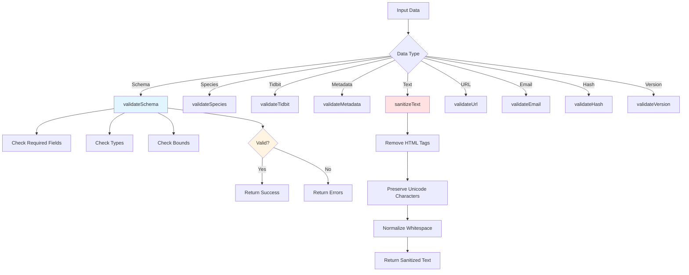

# Validation Utilities Documentation

## Overview

The `validation.js` module provides comprehensive schema validation and data sanitization utilities for the Infinite Pokédex server. It ensures data integrity, consistency, and security by validating Pokémon data structures and sanitizing text content.

**File Location**: `source/server/utils/validation.js`  
**Version**: 1.0.0  
**Author**: Infinite Pokédex Team

## Architecture Diagram



## Core Functions

### Schema Validation

#### `validateSchema(data, schema)`

Validates data against a schema definition with support for required fields, type checking, and bounds validation.

**Pre Conditions:**

- `data` must be an object
- `schema` must be an object with field definitions

**Post Conditions:**

- Returns validation result with `valid`, `errors`, and `warnings` properties

**Parameters:**

- `@param {Object} data` - Data to validate
- `@param {Object} schema` - Schema definition with field rules

**Returns:**

- `@return {Object}` - Validation result with structure:
  ```javascript
  {
    valid: boolean,
    errors: string[],
    warnings: string[]
  }
  ```

**Schema Field Rules:**

- `required` - Field must be present
- `type` - Expected data type (string, number, boolean, array, object)
- `maxLength` - Maximum length for strings/arrays
- `min` - Minimum value for numbers
- `max` - Maximum value for numbers

**Example:**

```javascript
const schema = {
  name: { type: 'string', required: true, maxLength: 50 },
  age: { type: 'number', required: true, min: 0, max: 100 },
};

const data = { name: 'Pikachu', age: 25 };
const result = validateSchema(data, schema);
// result.valid === true
```

### Pokémon Data Validation

#### `validateSpecies(species)`

Validates Pokémon species data against the expected schema.

**Pre Conditions:**

- `species` must be an object

**Post Conditions:**

- Returns validation result indicating if species data is valid

**Parameters:**

- `@param {Object} species` - Species data object

**Returns:**

- `@return {Object}` - Validation result

**Required Fields:**

- `id` (number, 1-10000)
- `name` (string, max 50 chars)
- `types` (array, max 2 elements)
- `sources` (object)

**Optional Fields:**

- `height_m` (number, 0-20)
- `weight_kg` (number, 0-10000)
- `abilities` (array, max 10 elements)
- `moves` (array, max 512 elements)
- `tidbits` (array, max 10 elements)

#### `validateTidbit(tidbit)`

Validates tidbit data against the expected schema.

**Pre Conditions:**

- `tidbit` must be an object

**Post Conditions:**

- Returns validation result indicating if tidbit data is valid

**Parameters:**

- `@param {Object} tidbit` - Tidbit data object

**Returns:**

- `@return {Object}` - Validation result

**Required Fields:**

- `title` (string, max 100 chars)
- `body` (string, max 500 chars)

**Optional Fields:**

- `sourceRefs` (array, max 5 elements)
- `quality` (object)

#### `validateMetadata(metadata)`

Validates dataset metadata against the expected schema.

**Pre Conditions:**

- `metadata` must be an object

**Post Conditions:**

- Returns validation result indicating if metadata is valid

**Parameters:**

- `@param {Object} metadata` - Dataset metadata object

**Returns:**

- `@return {Object}` - Validation result

**Required Fields:**

- `totalSpecies` (number, min 0)
- `contentHash` (string)

**Optional Fields:**

- `totalTidbits` (number, min 0)
- `sources` (array)

### Text Sanitization

#### `sanitizeText(text)`

Sanitizes text content by removing HTML tags, preserving Unicode characters, and normalizing whitespace.

**Pre Conditions:**

- `text` can be any type (non-strings return empty string)

**Post Conditions:**

- Returns sanitized text with HTML removed and whitespace normalized
- Preserves Unicode letters (é, ñ, etc.)
- Preserves gender symbols (♀, ♂)
- Preserves common punctuation (apostrophes, parentheses, hyphens, etc.)

**Parameters:**

- `@param {string} text` - Text to sanitize

**Returns:**

- `@return {string}` - Sanitized text

**Preserved Characters:**

- Unicode letters (\p{L}): All languages and accented characters
- Unicode numbers (\p{N}): All numeric characters
- Whitespace (\s): Normalized to single spaces
- Common punctuation: `-.,!?:;()'"`
- Gender symbols: `♀♂`

**Removed Characters:**

- HTML tags: `<tag>content</tag>`
- Special characters not in allowed list
- Leading/trailing whitespace

**Example:**

```javascript
// Preserves accented characters
sanitizeText('Flabébé is a fairy type');
// Returns: 'Flabébé is a fairy type'

// Preserves apostrophes
sanitizeText("Farfetch'd is a bird");
// Returns: "Farfetch'd is a bird"

// Preserves gender symbols
sanitizeText('Nidoran♀ and Nidoran♂');
// Returns: 'Nidoran♀ and Nidoran♂'

// Removes HTML tags
sanitizeText('Pikachu is <strong>electric</strong> type');
// Returns: 'Pikachu is electric type'

// Normalizes whitespace
sanitizeText('Multiple   spaces   here');
// Returns: 'Multiple spaces here'
```

### Format Validation

#### `validateUrl(url)`

Validates URL format.

**Pre Conditions:**

- `url` should be a string

**Post Conditions:**

- Returns true if URL is valid

**Parameters:**

- `@param {string} url` - URL to validate

**Returns:**

- `@return {boolean}` - True if valid URL

**Example:**

```javascript
validateUrl('https://example.com'); // true
validateUrl('not a url'); // false
```

#### `validateEmail(email)`

Validates email address format.

**Pre Conditions:**

- `email` should be a string

**Post Conditions:**

- Returns true if email format is valid

**Parameters:**

- `@param {string} email` - Email to validate

**Returns:**

- `@return {boolean}` - True if valid email

**Pattern:** `/^[^\s@]+@[^\s@]+\.[^\s@]+$/`

#### `validateHash(hash)`

Validates SHA-256 hash format.

**Pre Conditions:**

- `hash` should be a string

**Post Conditions:**

- Returns true if hash is valid SHA-256 format

**Parameters:**

- `@param {string} hash` - Hash to validate

**Returns:**

- `@return {boolean}` - True if valid hash

**Pattern:** 64 hexadecimal characters (`/^[a-f0-9]{64}$/`)

#### `validateVersion(version)`

Validates version string format.

**Pre Conditions:**

- `version` should be a string

**Post Conditions:**

- Returns true if version format is valid

**Parameters:**

- `@param {string} version` - Version to validate

**Returns:**

- `@return {boolean}` - True if valid version

**Format:** `YYYYMMDD-HHMM` (e.g., `20250108-1430`)

**Pattern:** `/^\d{8}-\d{4}$/`

## Testing

### Test Suite

Comprehensive test coverage is provided in `tests/unit/validation-runner.js`.

**Run Tests:**

```bash
node tests/unit/validation-runner.js
```

**Test Coverage:**

- ✅ Unicode character preservation (accented characters, gender symbols)
- ✅ Punctuation preservation (apostrophes, hyphens, parentheses)
- ✅ HTML tag removal
- ✅ Whitespace normalization
- ✅ Schema validation (required fields, types, bounds)
- ✅ Format validation (URLs, emails, hashes, versions)
- ✅ Edge cases (null, undefined, empty strings)

### Example Test Cases

```javascript
// Test 1: Preserve accented characters
const result = sanitizeText('Flabébé is a fairy type');
// Expected: 'Flabébé is a fairy type' ✅

// Test 2: Preserve apostrophes
const result = sanitizeText("Farfetch'd is a bird");
// Expected: "Farfetch'd is a bird" ✅

// Test 3: Preserve gender symbols
const result = sanitizeText('Nidoran♀ and Nidoran♂');
// Expected: 'Nidoran♀ and Nidoran♂' ✅

// Test 4: Remove HTML tags
const result = sanitizeText('Pikachu is <strong>electric</strong>');
// Expected: 'Pikachu is electric' ✅
```

## Bug Fixes

### Unicode Character Preservation (2025-01-08)

**Issue**: The `sanitizeText` function's regex was too aggressive, removing valid Unicode characters like accented letters (é, ñ), gender symbols (♀, ♂), and other special characters used in Pokémon names.

**Root Cause**: The regex pattern used `\w` which only matches ASCII word characters `[A-Za-z0-9_]`, causing all other characters to be removed.

**Fix**: Updated regex to use Unicode property escapes:

- `\p{L}` - Matches all Unicode letters
- `\p{N}` - Matches all Unicode numbers
- Added `u` flag for Unicode support

**Before:**

```javascript
.replace(/[^\w\s\-.,!?:;()'"]/g, '')
```

**After:**

```javascript
.replace(/[^\p{L}\p{N}\s\-.,!?:;()'"♀♂]/gu, '')
```

**Impact**:

- ✅ Preserves Pokémon names like Flabébé, Farfetch'd, Nidoran♀/♂
- ✅ Supports international characters in descriptions
- ✅ Prevents data corruption during sanitization

## Usage Examples

### Complete Validation Workflow

```javascript
import {
  validateSpecies,
  validateTidbit,
  sanitizeText,
} from './utils/validation.js';

// 1. Sanitize text content
const name = sanitizeText(rawName); // 'Flabébé'
const description = sanitizeText(rawDescription);

// 2. Validate species data
const species = {
  id: 25,
  name: name,
  types: ['Electric'],
  sources: { bulbapedia: 'https://...' },
};

const speciesValidation = validateSpecies(species);
if (!speciesValidation.valid) {
  console.error('Species validation failed:', speciesValidation.errors);
}

// 3. Validate tidbit data
const tidbit = {
  title: sanitizeText(rawTitle),
  body: sanitizeText(rawBody),
  sourceRefs: ['bulbapedia'],
};

const tidbitValidation = validateTidbit(tidbit);
if (!tidbitValidation.valid) {
  console.error('Tidbit validation failed:', tidbitValidation.errors);
}
```

## Dependencies

- None (pure JavaScript with ES6 modules)

## Related Files

- `source/server/processors/parser.js` - Uses sanitizeText for data cleaning
- `source/server/builders/dataset-builder.js` - Uses validation functions
- `source/server/processors/tidbit-synthesizer.js` - Uses validation functions
- `tests/unit/validation-runner.js` - Test suite

## See Also

- [Backend Structure Doc](/docs/agents/Backend%20Structure%20Doc.md)
- [Testing Guidelines](/docs/agents/Testing%20Guidelines.md)
- [Data Processing Documentation](/docs/code/server/parser.md) (if exists)
