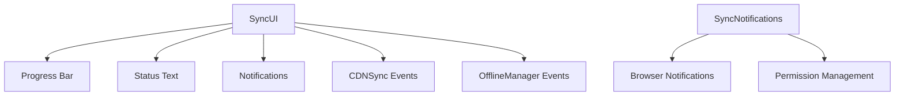

# Sync UI Components Documentation

## Overview

The Sync UI Components provide visual feedback for sync operations, including progress bars, status messages, and browser notifications.

## Architecture



## Core Components

### SyncUI Class

Manages the sync progress UI widget.

**Location**: `source/client/js/sync-ui.js`

**Dependencies**:

- `logger.js` - Logging utilities
- `sync.js` - CDN sync system
- `offline.js` - Offline manager

**Key Methods**:

#### `initialize()`

Initializes the sync UI by creating DOM elements and setting up event listeners.

**Preconditions**: DOM is loaded
**Postconditions**: UI elements are created and event listeners registered

#### `show()`

Shows the sync UI widget.

**Preconditions**: UI is initialized
**Postconditions**: UI is visible

#### `hide()`

Hides the sync UI widget.

**Preconditions**: UI is initialized
**Postconditions**: UI is hidden

#### `updateProgress(current, total, percentage)`

Updates the progress display.

**Parameters**:

- `current` (number) - Current progress
- `total` (number) - Total items
- `percentage` (number) - Percentage complete

#### `showComplete()`

Shows completion message and auto-hides after 2 seconds.

#### `showError(message)`

Shows an error message.

**Parameters**:

- `message` (string) - Error message

#### `showOfflineMessage()`

Shows offline status message.

#### `reset()`

Resets UI to initial state.

### SyncNotifications Class

Manages browser notifications for sync events.

**Location**: `source/client/js/sync-ui.js`

**Key Methods**:

#### `requestPermission()`

Requests notification permission from the user.

**Returns**: Promise<string> - Permission status

#### `show(title, options)`

Shows a browser notification.

**Parameters**:

- `title` (string) - Notification title
- `options` (Object) - Notification options

**Returns**: Notification|null - Notification instance

#### `showSyncComplete(count)`

Shows sync complete notification.

**Parameters**:

- `count` (number) - Number of items synced

#### `showSyncError(error)`

Shows sync error notification.

**Parameters**:

- `error` (string) - Error message

#### `showUpdateAvailable()`

Shows update available notification.

## UI Design

### Widget Appearance

```
┌─────────────────────────────┐
│ Syncing Data              × │
├─────────────────────────────┤
│ Syncing 50 of 100 chunks... │
│ ▓▓▓▓▓▓▓▓▓▓░░░░░░░░░░░░░░░░ │
│            50%              │
└─────────────────────────────┘
```

### Styling

- **Position**: Fixed bottom center
- **Background**: White with shadow
- **Border Radius**: 12px
- **Animation**: Slide up/down
- **Colors**: Gen 9 gradient (purple to blue)

### Responsive Design

- **Desktop**: 300px width
- **Mobile**: 90% width
- **Max Width**: 90% viewport

## Progress Tracking

### Event Integration

The UI automatically listens to sync progress events:

```javascript
cdnSync.onProgress((current, total, percentage) => {
  syncUI.updateProgress(current, total, percentage);
});
```

### Progress States

1. **Preparing**: Initial state before sync starts
2. **Syncing**: Active download with progress
3. **Complete**: Sync finished successfully
4. **Error**: Sync encountered an error
5. **Offline**: Device went offline during sync

## Browser Notifications

### Permission Flow

1. **Check Permission**: Check current permission status
2. **Request**: Request permission if not granted
3. **Show**: Show notifications when granted

### Notification Types

#### Sync Complete

```javascript
syncNotifications.showSyncComplete(1025);
// "Successfully synced 1025 Pokémon!"
```

#### Sync Error

```javascript
syncNotifications.showSyncError('Network error');
// "Failed to sync data. Please try again."
```

#### Update Available

```javascript
syncNotifications.showUpdateAvailable();
// "New Pokémon data is available. Tap to update."
```

### Notification Options

```javascript
{
  icon: '/assets/icons/icon-192.png',
  badge: '/assets/icons/icon-192.png',
  tag: 'sync-complete',
  requireInteraction: false
}
```

## Integration

### With CDN Sync

```javascript
// Initialize UI
syncUI.initialize();

// Start sync
syncUI.show();
await cdnSync.syncDataset();

// Progress updates happen automatically
// UI hides automatically on completion
```

### With Offline Manager

```javascript
offlineManager.addListener((isOnline) => {
  if (!isOnline) {
    syncUI.showOfflineMessage();
  }
});
```

## Customization

### Styling

Override CSS classes:

```css
.sync-ui-container {
  /* Custom styles */
}
```

### Messages

Customize status messages:

```javascript
syncUI.statusText.textContent = 'Custom message';
```

### Colors

Modify gradient colors:

```javascript
this.progressBar.style.background =
  'linear-gradient(90deg, #custom1 0%, #custom2 100%)';
```

## Accessibility

### ARIA Labels

- Progress bar has `role="progressbar"`
- Status text has `aria-live="polite"`
- Close button has `aria-label="Close"`

### Keyboard Navigation

- Close button is keyboard accessible
- Focus management for modal behavior

### Screen Readers

- Progress updates announced
- Status changes announced
- Error messages announced

## Performance

### DOM Operations

- Minimal DOM manipulation
- CSS transitions for animations
- Efficient event handling

### Memory Usage

- Single widget instance
- Cleanup on hide
- No memory leaks

## Testing

### Manual Testing

1. **Show Widget**: Call `syncUI.show()`
2. **Update Progress**: Call `updateProgress(50, 100, 50)`
3. **Show Complete**: Call `showComplete()`
4. **Show Error**: Call `showError('Test error')`
5. **Hide Widget**: Call `syncUI.hide()`

### Automated Testing

Test UI interactions:

```javascript
// Show UI
syncUI.show();
expect(syncUI.isVisible).toBe(true);

// Update progress
syncUI.updateProgress(50, 100, 50);
expect(syncUI.percentageText.textContent).toBe('50%');

// Hide UI
syncUI.hide();
expect(syncUI.isVisible).toBe(false);
```

## Best Practices

### User Experience

1. **Show Progress**: Always show progress for long operations
2. **Clear Messages**: Use clear, concise status messages
3. **Auto-Hide**: Hide UI automatically on completion
4. **Error Handling**: Show clear error messages with retry options

### Performance

1. **Throttle Updates**: Don't update UI too frequently
2. **Batch DOM Updates**: Batch multiple DOM changes
3. **Use CSS Transitions**: Use CSS for animations

### Accessibility

1. **Keyboard Access**: Ensure all controls are keyboard accessible
2. **Screen Readers**: Provide appropriate ARIA labels
3. **Color Contrast**: Ensure sufficient color contrast

## Future Enhancements

1. **Pause/Resume**: Add pause/resume controls
2. **Detailed Progress**: Show individual file progress
3. **Estimated Time**: Show estimated time remaining
4. **Cancel**: Add cancel button
5. **Themes**: Support light/dark themes

## Troubleshooting

### UI Not Showing

- Check if `initialize()` was called
- Verify DOM is loaded
- Check CSS styles are applied

### Progress Not Updating

- Verify progress callbacks are registered
- Check sync system is emitting events
- Check browser console for errors

### Notifications Not Showing

- Check permission status
- Request permission if needed
- Verify notification API is supported

## Related Documentation

- [CDN Sync System](./sync.md)
- [Offline Support](./offline.md)
- [Frontend Guidelines](../agents/Frontend Guidelines.md)
