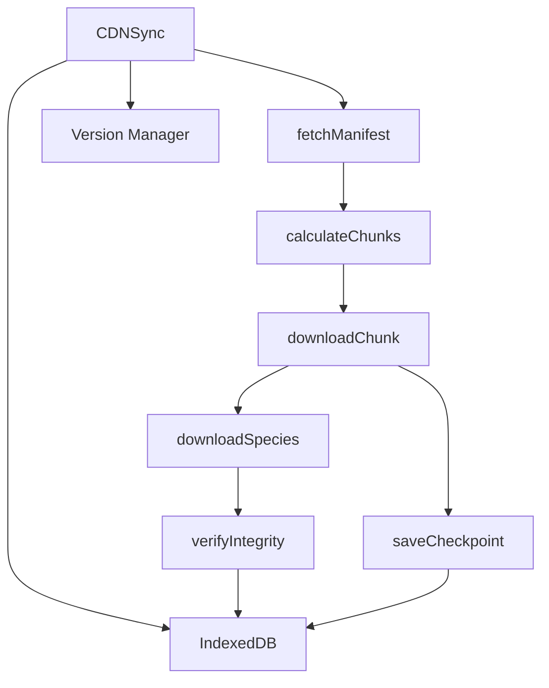

# CDN Sync System Documentation

## Overview

The CDN Sync System handles downloading and synchronizing Pokémon data from the CDN to IndexedDB. It supports chunked downloads, resume capability, progress tracking, and data integrity verification.

## Architecture



## Core Components

### CDNSync Class

Main class for managing the sync process.

**Location**: `source/client/js/sync.js`

**Dependencies**:
- `storage.js` - IndexedDB wrapper
- `logger.js` - Logging utilities
- `version.js` - Version management

**Key Methods**:

#### `initialize()`
Initializes the sync system by opening the database and loading the current version.

**Preconditions**: None
**Postconditions**: Database opened, current version loaded

#### `fetchManifest()`
Fetches the manifest from the CDN with retry logic.

**Preconditions**: Network available
**Postconditions**: Returns manifest object with version and species list
**Throws**: Error if fetch fails after max retries

#### `calculateChunks(manifest)`
Divides the species list into chunks for efficient downloading.

**Parameters**:
- `manifest` (Object) - CDN manifest with species list

**Returns**: Array of chunk objects

**Preconditions**: Manifest is valid
**Postconditions**: Returns array of chunk objects

#### `downloadChunk(chunk)`
Downloads all species in a chunk and saves a checkpoint.

**Parameters**:
- `chunk` (Object) - Chunk object with species list

**Preconditions**: Network available, chunk is valid
**Postconditions**: Species data stored in IndexedDB

#### `downloadSpecies(speciesRef)`
Downloads a single species data file with integrity verification.

**Parameters**:
- `speciesRef` (Object) - Species reference from manifest

**Preconditions**: Network available
**Postconditions**: Species data stored in IndexedDB

#### `syncDataset()`
Performs a full dataset sync with resume capability.

**Preconditions**: Network available, database initialized
**Postconditions**: Dataset synced to latest version
**Throws**: Error if sync fails

## Configuration

### Constants

- `CDN_BASE_URL`: Base URL for CDN (default: `https://cdn.infinite-pokedex.com`)
- `CHUNK_SIZE`: Number of species per chunk (default: 100)
- `MAX_RETRIES`: Maximum retry attempts (default: 3)
- `RETRY_DELAY_MS`: Initial retry delay in milliseconds (default: 1000)

### Environment Variables

- `VITE_CDN_URL`: Override CDN base URL

## Data Flow

1. **Initialization**: Load current version from IndexedDB
2. **Manifest Fetch**: Download manifest from CDN
3. **Version Check**: Compare current version with manifest version
4. **Chunk Calculation**: Divide species list into chunks
5. **Download**: Download each chunk with progress tracking
6. **Integrity Check**: Verify data integrity using SHA-256 hashes
7. **Storage**: Store species data in IndexedDB
8. **Checkpoint**: Save progress after each chunk
9. **Completion**: Update version and clear checkpoint

## Resume Capability

The sync system supports resuming interrupted downloads:

1. **Checkpoint Saving**: After each chunk is downloaded, a checkpoint is saved
2. **Resume Detection**: On sync start, check for existing checkpoint
3. **Resume**: If checkpoint exists, resume from the next chunk
4. **Cleanup**: Clear checkpoint after successful completion

## Progress Tracking

Progress callbacks can be registered to track sync progress:

```javascript
cdnSync.onProgress((current, total, percentage) => {
  console.log(`Progress: ${percentage}%`);
});
```

## Error Handling

### Retry Logic

- Exponential backoff for failed requests
- Maximum retry attempts configurable
- Detailed error logging

### Failure Scenarios

1. **Network Failure**: Retry with exponential backoff
2. **Integrity Failure**: Re-download species data
3. **Storage Failure**: Log error and continue
4. **Manifest Failure**: Abort sync and throw error

## Integration

### With Version Manager

- Validates manifest structure
- Checks for updates
- Verifies data integrity
- Tracks version history

### With Service Worker

- Caches CDN responses
- Handles offline requests
- Coordinates background sync

### With UI

- Progress callbacks for UI updates
- Status notifications
- Error messaging

## Testing

### Unit Tests

**Location**: `tests/unit/sync.test.js`

**Coverage**:
- Initialization
- Manifest fetching
- Chunk calculation
- Species download
- Checkpoint management
- Progress callbacks
- Error handling
- Retry logic

### Integration Tests

Test sync with real CDN (mocked in development):

```bash
npm run test:integration
```

## Performance Considerations

### Chunking Strategy

- Default chunk size: 100 species
- Balances memory usage and network efficiency
- Adjustable based on device capabilities

### Memory Management

- Process chunks sequentially
- Clear processed data from memory
- Use streaming for large files

### Network Optimization

- Parallel downloads within chunks (future enhancement)
- Compression support
- CDN caching headers

## Security

### Data Integrity

- SHA-256 hash verification for all downloads
- Manifest signature verification (future enhancement)
- Content validation before storage

### Network Security

- HTTPS only
- CORS headers
- Rate limiting compliance

## Future Enhancements

1. **Parallel Downloads**: Download multiple species simultaneously
2. **Delta Sync**: Only download changed data
3. **Compression**: Support gzip/brotli compression
4. **Prioritization**: Download popular Pokémon first
5. **Background Sync**: Use Background Sync API for automatic updates

## Troubleshooting

### Sync Fails to Start

- Check network connectivity
- Verify CDN URL is accessible
- Check IndexedDB quota

### Sync Stalls

- Check for network interruptions
- Verify checkpoint is being saved
- Check browser console for errors

### Integrity Failures

- Re-download affected species
- Clear cache and retry
- Report issue if persistent

## Related Documentation

- [Version Management](./version.md)
- [Service Worker](./sw.md)
- [IndexedDB Storage](./storage.md)
- [Offline Support](./offline.md)
