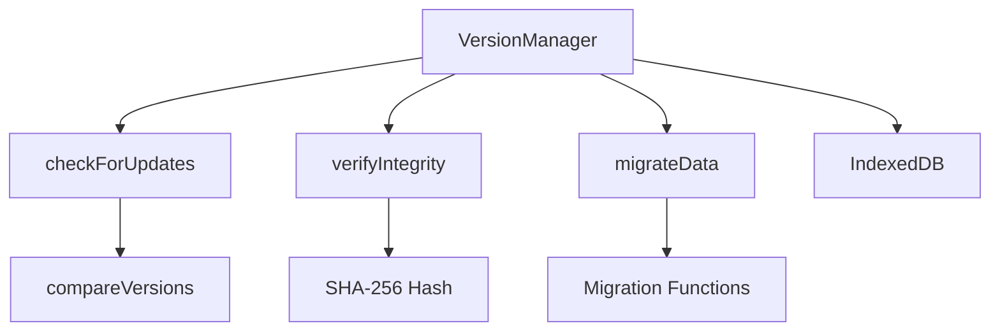

# Version Management Documentation

## Overview

The Version Management system handles dataset versioning, integrity checks, and data migration. It ensures that the client always has a valid, up-to-date dataset with proper version tracking.

## Architecture



## Core Components

### VersionManager Class

Main class for managing dataset versions and integrity.

**Location**: `source/client/js/version.js`

**Dependencies**:

- `storage.js` - IndexedDB wrapper
- `logger.js` - Logging utilities

**Key Methods**:

#### `initialize()`

Initializes the version manager and loads the current version from storage.

**Preconditions**: IndexedDB is available
**Postconditions**: Current version is loaded from storage

#### `compareVersions(v1, v2)`

Compares two semantic version strings.

**Parameters**:

- `v1` (string) - First version
- `v2` (string) - Second version

**Returns**: -1 if v1 < v2, 0 if equal, 1 if v1 > v2

**Examples**:

```javascript
compareVersions('1.0.0', '1.0.1'); // -1
compareVersions('2.0.0', '1.5.0'); // 1
compareVersions('1.2.3', '1.2.3'); // 0
```

#### `checkForUpdates(manifestUrl)`

Checks if a new version is available by fetching the manifest.

**Parameters**:

- `manifestUrl` (string) - URL to the manifest file

**Returns**: Promise<boolean> - True if new version available

**Preconditions**: manifestUrl is a valid CDN manifest URL
**Postconditions**: Returns boolean indicating if update is available

#### `verifyIntegrity(data, expectedHash)`

Verifies data integrity using SHA-256 checksums.

**Parameters**:

- `data` (Object) - Data to verify
- `expectedHash` (string) - Expected SHA-256 hash

**Returns**: Promise<boolean> - True if data is valid

**Preconditions**: data is a valid object, expectedHash is a SHA-256 hash string
**Postconditions**: Returns boolean indicating if data matches hash

#### `validateManifest(manifest)`

Validates manifest structure and required fields.

**Parameters**:

- `manifest` (Object) - Manifest to validate

**Returns**: boolean - True if manifest is valid

**Required Fields**:

- `version` - Semantic version string
- `timestamp` - Unix timestamp
- `files` - Array of file objects
- `totalSize` - Total size in bytes

#### `updateVersion(newVersion)`

Updates to a new version in storage.

**Parameters**:

- `newVersion` (string) - New version to set

**Preconditions**: newVersion is a valid version string
**Postconditions**: Current version is updated in storage

#### `migrateData(fromVersion, toVersion)`

Performs data migration if needed between versions.

**Parameters**:

- `fromVersion` (string) - Version to migrate from
- `toVersion` (string) - Version to migrate to

**Preconditions**: fromVersion and toVersion are valid version strings
**Postconditions**: Data is migrated to new version format

## Version Format

### Semantic Versioning

The system uses semantic versioning (SemVer):

```
MAJOR.MINOR.PATCH
```

- **MAJOR**: Incompatible API changes
- **MINOR**: Backward-compatible functionality additions
- **PATCH**: Backward-compatible bug fixes

### Examples

- `1.0.0` - Initial release
- `1.1.0` - New Pokémon added
- `1.1.1` - Bug fixes
- `2.0.0` - Breaking changes (schema update)

## Data Integrity

### SHA-256 Hashing

All downloaded data is verified using SHA-256 hashes:

1. **Hash Generation**: Server generates hash for each file
2. **Hash Distribution**: Hashes included in manifest
3. **Client Verification**: Client computes hash and compares
4. **Failure Handling**: Re-download on mismatch

### Integrity Check Process

```javascript
const data = {
  /* species data */
};
const expectedHash = 'abc123...';

const isValid = await versionManager.verifyIntegrity(data, expectedHash);

if (!isValid) {
  // Re-download data
}
```

## Version History

### Tracking

The system maintains a version history in IndexedDB:

```javascript
{
  version: '1.1.0',
  timestamp: 1234567890,
  totalSpecies: 1025,
  syncDuration: 45000
}
```

### Retrieval

```javascript
const history = await versionManager.getVersionHistory();
// Returns array of version entries
```

## Migration System

### Migration Framework

The migration system supports version-specific migrations:

```javascript
const migrations = {
  '1.0.0_to_1.1.0': migrate_1_0_0_to_1_1_0,
  '1.1.0_to_2.0.0': migrate_1_1_0_to_2_0_0,
};
```

### Migration Functions

Each migration function handles specific version transitions:

```javascript
async function migrate_1_0_0_to_1_1_0() {
  // Add new fields
  // Transform data structures
  // Update indexes
}
```

### Automatic Migration

Migrations run automatically during sync:

1. **Detect Version Change**: Compare current and new versions
2. **Find Migration Path**: Look up migration function
3. **Execute Migration**: Run migration function
4. **Update Version**: Set new version after success

## Manifest Validation

### Required Fields

```javascript
{
  version: '1.0.0',           // Semantic version
  timestamp: 1234567890,      // Unix timestamp
  files: [                    // Array of file objects
    {
      path: '/data/1.json',
      size: 1024,
      hash: 'abc123...'
    }
  ],
  totalSize: 1024000          // Total size in bytes
}
```

### Validation Process

1. **Structure Check**: Verify all required fields exist
2. **Type Check**: Verify field types are correct
3. **File Validation**: Verify each file entry is valid
4. **Consistency Check**: Verify totalSize matches sum of files

## Integration

### With CDN Sync

- Validates manifests before processing
- Verifies downloaded data integrity
- Updates version after successful sync
- Tracks version history

### With Service Worker

- Coordinates cache invalidation on version change
- Handles version-specific caching strategies

## Testing

### Unit Tests

**Location**: `tests/unit/version.test.js`

**Coverage**:

- Version comparison
- Integrity verification
- Manifest validation
- Update detection
- History tracking

### Test Examples

```javascript
// Version comparison
expect(compareVersions('1.0.0', '1.0.1')).toBe(-1);

// Integrity verification
const isValid = await verifyIntegrity(data, hash);
expect(isValid).toBe(true);

// Manifest validation
const isValid = validateManifest(manifest);
expect(isValid).toBe(true);
```

## Performance

### Hashing Performance

- SHA-256 is computed using Web Crypto API
- Hardware acceleration when available
- Minimal impact on sync performance

### Storage Overhead

- Version metadata: ~1KB per version
- History entries: ~100 bytes each
- Negligible impact on storage quota

## Security

### Hash Algorithm

- SHA-256 provides strong integrity guarantees
- Resistant to collision attacks
- Industry-standard cryptographic hash

### Version Validation

- Semantic version format validation
- Timestamp validation
- Size validation

## Future Enhancements

1. **Signature Verification**: Add cryptographic signatures
2. **Delta Updates**: Only download changed data
3. **Rollback Support**: Revert to previous versions
4. **Version Pinning**: Pin to specific versions
5. **Automatic Updates**: Background version checks

## Troubleshooting

### Version Mismatch

- Clear cache and re-sync
- Check manifest URL
- Verify network connectivity

### Integrity Failures

- Re-download affected files
- Check for corrupted data
- Verify hash algorithm

### Migration Failures

- Check migration function logs
- Verify data format compatibility
- Restore from backup if available

## Related Documentation

- [CDN Sync System](./sync.md)
- [IndexedDB Storage](./storage.md)
- [Service Worker](./sw.md)
