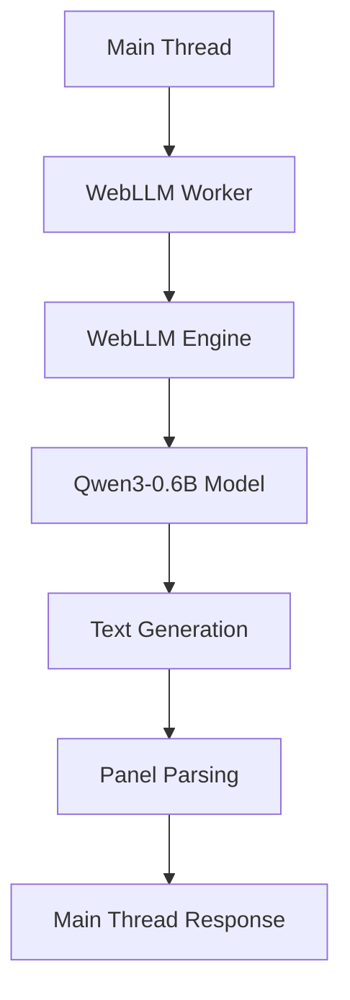

# WebLLM Worker

## Overview

The WebLLM Worker provides on-device Large Language Model inference for generating Pokémon lore panels. It uses WebLLM to run quantized models directly in the browser, ensuring privacy and offline capability.

## Architecture



## Key Features

- **On-device Inference**: Runs ML models directly in browser using WebLLM
- **Privacy-focused**: No data sent to external servers
- **Offline-capable**: Works without internet connection
- **Progress Tracking**: Real-time generation progress updates
- **Error Handling**: Graceful degradation and user feedback
- **Telemetry**: Performance and usage tracking

## Model Configuration

```javascript
const MODEL_CONFIG = {
  model: 'mlc-ai/Qwen3-0.6B-q4f16_0-MLC',
  modelId: 'Qwen3-0.6B-q4f16_0-MLC',
  modelLib: 'https://cdn.jsdelivr.net/npm/@mlc-ai/web-llm@0.2.65/dist/',
};
```

## Message Protocol

### Incoming Messages

#### `generate-lore`

Generates lore panels for a Pokémon.

**Payload:**

```javascript
{
  type: 'generate-lore',
  data: {
    pokemonName: 'bulbasaur',
    tidbits: [...] // Array of tidbit objects
  }
}
```

**Response:**

```javascript
{
  type: 'lore-generated',
  data: {
    pokemonName: 'bulbasaur',
    lorePanels: [...], // Array of 5 panel objects
    success: true,
    telemetry: { duration: 2500 }
  }
}
```

#### `get-status`

Retrieves worker status and progress.

**Response:**

```javascript
{
  type: 'status-response',
  data: {
    isReady: true,
    isInitialized: true,
    isGenerating: false,
    progress: {
      stage: 'ready',
      progress: 100,
      message: 'Model ready for generation'
    }
  }
}
```

#### `get-telemetry`

Retrieves performance metrics.

**Response:**

```javascript
{
  type: 'telemetry-response',
  data: {
    generations: 5,
    errors: 0,
    totalTime: 12500,
    uptime: 3600000,
    averageGenerationTime: 2500
  }
}
```

### Outgoing Messages

#### `worker-ready`

Worker initialization complete.

#### `progress-update`

Generation progress updates.

#### `worker-error`

Worker encountered an error.

## Prompt Engineering

### System Prompt

```
You are an expert Pokémon lore researcher creating "iceberg" content for a Pokédex app.
You have access to comprehensive web-crawled data from Bulbapedia, Smogon strategy guides, Serebii, and community forums.
Generate intriguing, accurate tidbits that reveal hidden depths of Pokémon lore and connections.
```

### User Prompt Template

```
You are creating "iceberg" tidbits for {pokemonName} using comprehensive web research.

WEB RESEARCH CONTEXT ({sources}) - {pages} pages, {contentLength} chars):
{contextWindow}

BASIC SPECIES DATA:
{speciesData}

FORUM DISCUSSIONS:
{forumData}

INSTRUCTIONS:
Create 5 intriguing tidbits that reveal hidden depths of {pokemonName}'s lore. Use the web research context to find connections, theories, and obscure facts...

Format as JSON: { "tidbits": [...] }
```

## Error Handling

- **Model Loading**: Falls back gracefully if WebLLM unavailable
- **Generation Failures**: Provides detailed error messages via console
- **Network Issues**: Handles WebLLM CDN failures
- **Memory Limits**: Monitors and reports memory usage issues

## Performance Considerations

- **Model Size**: Qwen3-0.6B (4-bit quantized) ~ 400MB
- **Initialization**: ~30-60 seconds first load
- **Generation**: ~2-5 seconds per 5 panels
- **Memory**: ~1GB RAM usage during generation

## Browser Compatibility

- **Chrome/Edge**: Full support
- **Firefox**: Limited support (WebGPU)
- **Safari**: Limited support
- **Mobile**: Limited by device memory

## Security Considerations

- **No Data Exfiltration**: All processing happens client-side
- **Input Sanitization**: User inputs are sanitized before processing
- **Model Validation**: Only trusted models from official sources
- **Error Boundaries**: Prevents crashes from propagating to main thread

## Testing

```bash
# Run WebLLM worker tests
npm test -- tests/unit/webllm-worker.test.js
```

## Future Enhancements

- **Model Switching**: Support for multiple model sizes
- **Caching**: Generated content caching across sessions
- **Streaming**: Real-time text generation updates
- **Fine-tuning**: Custom model adaptation for Pokémon domain
