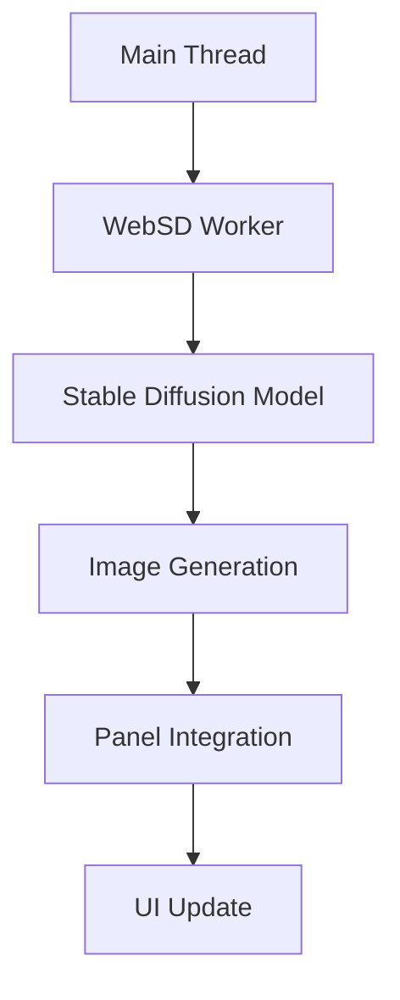

# WebSD Worker

## Overview

The WebSD Worker provides on-device Stable Diffusion image generation for creating artwork that accompanies Pokémon lore panels. It generates contextual images based on the content and themes of each lore panel.

## Architecture



## Key Features

- **Contextual Art**: Generates images based on lore panel content
- **Theme-aware**: Adapts style based on panel themes (ancient, battle, nature, etc.)
- **Progressive Loading**: Shows generation progress for each panel
- **Memory Management**: Efficient resource usage with WebGL/WebGPU
- **Fallback Support**: Graceful degradation when WebSD unavailable

## Current Implementation

**Note**: Current implementation uses mock artwork generation for demonstration. Real WebSD integration would require:

```javascript
import * as websd from '@mlc-ai/web-sd'; // Hypothetical library

const model = await websd.createModel({
  model: 'mlc-ai/stable-diffusion-v1-5-q4f16_0-MLC',
  device: 'webgpu',
});
```

## Message Protocol

### Incoming Messages

#### `generate-artwork`

Generates artwork for a specific lore panel.

**Payload:**

```javascript
{
  type: 'generate-artwork',
  data: {
    pokemonName: 'bulbasaur',
    lorePanel: {
      title: 'Ancient Origins',
      body: 'Bulbasaur traces its roots to ancient times...',
      panelNumber: 1
    }
  }
}
```

**Response:**

```javascript
{
  type: 'artwork-generated',
  data: {
    panelNumber: 1,
    prompt: 'bulbasaur Pokémon, ancient ruins background...',
    imageData: {
      theme: 'ancient',
      imageUrl: 'data:image/png;base64,...',
      altText: 'Bulbasaur - Ancient Origins',
      metadata: { pokemon: 'bulbasaur', panel: 1, theme: 'ancient' }
    }
  }
}
```

## Prompt Engineering

### Theme Detection

Automatically detects themes from lore content:

```javascript
const themes = {
  ancient: /ancient|mysterious|old|ancient|ruins|historical/i,
  battle: /battle|warrior|combat|fight|damage|strong/i,
  nature: /nature|forest|wild|natural|growth|leaf/i,
  evolution: /evolve|evolution|transform|change|grow/i,
};
```

### Prompt Generation

Creates detailed prompts based on panel content:

```javascript
const prompt = `${pokemonName} Pokémon, ${lorePanel.body}, ${styleElements.join(', ')}, digital art, detailed, high quality, Pokémon style`;
```

## Integration Points

### With Lore Generation

1. **Sequential Processing**: Artwork generates after lore completion
2. **Panel Mapping**: Each panel gets unique artwork
3. **Progress Coordination**: Combined progress bars for text + image
4. **Error Isolation**: Artwork failures don't block lore display

### With UI Components

- **Panel Artwork**: Images display above lore text
- **Loading States**: Progress indicators during generation
- **Error Handling**: Fallback placeholders for failed generations
- **Responsive Design**: Images scale appropriately on all devices

## Performance Characteristics

- **Model Size**: ~2GB (Stable Diffusion 1.5 quantized)
- **Generation Time**: 5-15 seconds per image
- **Memory Usage**: 2-4GB during generation
- **Initialization**: 60-120 seconds first load

## Browser Compatibility

- **Chrome/Edge**: Full WebGPU support
- **Firefox**: Limited WebGPU support
- **Safari**: No WebGPU support (fallback to WebGL)
- **Mobile**: Limited by memory constraints

## Security & Privacy

- **Client-side Only**: No images sent to external servers
- **Input Sanitization**: Prompts validated before processing
- **Content Filtering**: Prevents inappropriate content generation
- **Resource Limits**: Prevents excessive resource usage

## Testing Strategy

```javascript
// Mock WebSD for testing
jest.mock('@mlc-ai/web-sd', () => ({
  createModel: jest.fn(),
  generateImage: jest.fn().mockResolvedValue(mockImageData),
}));
```

## Future Implementation

### Real WebSD Integration

```javascript
// Future implementation
import { WebStableDiffusionPipeline } from '@huggingface/transformers';

const pipeline = await WebStableDiffusionPipeline.from_pretrained(
  'CompVis/stable-diffusion-v1-4',
  { quantized: true }
);

const image = await pipeline(prompt, {
  guidance_scale: 7.5,
  num_inference_steps: 20,
});
```

### Advanced Features

- **Style Customization**: User-selectable art styles
- **Batch Generation**: Generate all panel artwork simultaneously
- **Quality Settings**: Adjustable detail levels
- **Custom Models**: Fine-tuned Pokémon-specific models

## Error Handling

- **Model Loading**: Fallback to placeholder images
- **Generation Failures**: Detailed console logging
- **Memory Issues**: Automatic cleanup and retry
- **Network Problems**: Offline fallback images

## Accessibility

- **Alt Text**: Descriptive text for all generated images
- **Loading States**: Clear progress indication
- **Error Messages**: User-friendly failure notifications
- **Reduced Motion**: Respects user accessibility preferences
