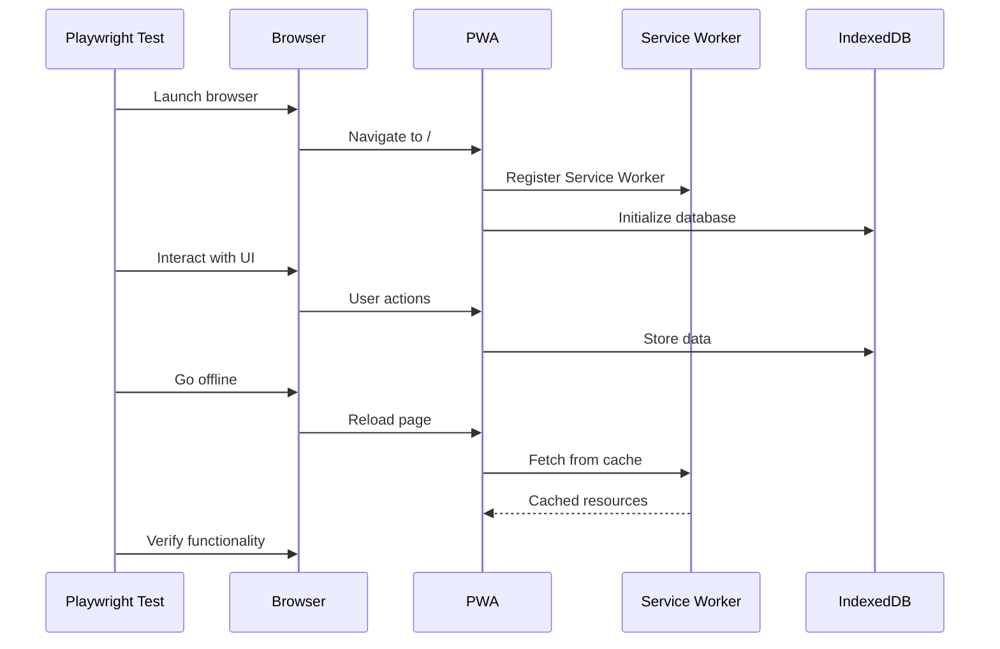

# Integration Testing Guide

This document describes the end-to-end testing approach for Infinite Pokédex using Playwright.

## Overview

Integration tests verify complete user flows across the PWA, including:
- PWA installation and offline functionality
- UI interactions and animations
- IndexedDB storage and persistence
- Service Worker caching
- Mobile responsiveness

## Test Structure

Tests are located in `/tests/integration/` and organized by feature:
- `pwa.test.js` - PWA functionality and offline capabilities
- `ui.test.js` - User interface interactions and animations
- `storage.test.js` - IndexedDB and data persistence

## Running Tests

### Local Development
```bash
# Run all E2E tests
npm run test:e2e

# Run specific test file
npx playwright test tests/integration/pwa.test.js

# Run in headed mode (see browser)
npx playwright test --headed

# Run in debug mode
npx playwright test --debug
```

### CI/CD
Tests run automatically on pull requests via GitHub Actions. See `.github/workflows/ci.yml` for configuration.

## Test Configuration

Configuration is in `playwright.config.js`:
- **Test Directory**: `./tests/integration`
- **Base URL**: `http://localhost:5173`
- **Devices**: Desktop Chrome, Mobile Chrome (Pixel 5), Mobile Safari (iPhone 12)
- **Retries**: 2 retries in CI, 0 locally
- **Timeout**: 30 seconds per test

## PWA Tests

### Test: Application Load
Verifies the app loads correctly with proper title.

### Test: Valid Manifest
Checks that the PWA manifest exists and contains required fields:
- name, short_name, start_url, display, icons

### Test: Service Worker Registration
Confirms the Service Worker registers successfully.

### Test: Gen 9 Pokédex Styling
Validates that the UI has the correct Rotom-style aesthetic with proper colors.

### Test: Mobile Responsiveness
Tests that the app is responsive on mobile viewports (375x667).

### Test: Offline Functionality
Verifies the app works offline after initial load:
1. Load app online
2. Go offline
3. Reload page
4. Confirm app still works

## UI Tests

### Test: Pokédex List Display
Checks that Pokémon cards are displayed in the list.

### Test: Search Functionality
Verifies search input filters results correctly.

### Test: Entry Navigation
Tests clicking a card opens the detailed entry view.

### Test: Smooth Animations
Confirms animations are applied with proper CSS transitions.

### Test: Type Badges
Validates that type badges are displayed for Pokémon.

### Test: Keyboard Navigation
Tests accessibility with keyboard Tab navigation.

## Storage Tests

### Test: IndexedDB Initialization
Confirms IndexedDB is available and initialized.

### Test: Data Storage
Verifies data is stored in IndexedDB object stores.

### Test: Data Persistence
Tests that data persists across page reloads.

## Best Practices

### Writing Tests
- Use descriptive test names
- Wait for elements with `waitForSelector`
- Use `waitForLoadState('networkidle')` for full page loads
- Add timeouts for slow operations
- Clean up test data after tests

### Debugging
- Use `--headed` to see browser
- Use `--debug` for step-by-step debugging
- Add `await page.pause()` to pause execution
- Check screenshots in `test-results/` on failure

### Mobile Testing
- Test on actual mobile viewports
- Verify touch interactions
- Check responsive design breakpoints
- Test offline functionality on mobile

## Common Issues

### Service Worker Not Registering
- Ensure dev server is running
- Check browser console for errors
- Verify `sw.js` exists and is accessible

### Tests Timing Out
- Increase timeout in test configuration
- Add explicit waits for slow operations
- Check network conditions

### Offline Tests Failing
- Ensure Service Worker is registered first
- Wait for `networkidle` before going offline
- Verify caching strategy in `sw.js`

## Mermaid Diagram



## Coverage Goals

- **PWA Features**: 100% of manifest, SW, and offline functionality
- **UI Interactions**: All major user flows (search, navigation, entry view)
- **Storage**: All IndexedDB operations
- **Mobile**: All responsive breakpoints and touch interactions

## Future Tests

- AI generation integration (WebLLM/WebSD)
- Background sync functionality
- Push notifications (if implemented)
- Multi-language support
- Accessibility compliance (WCAG AA)
